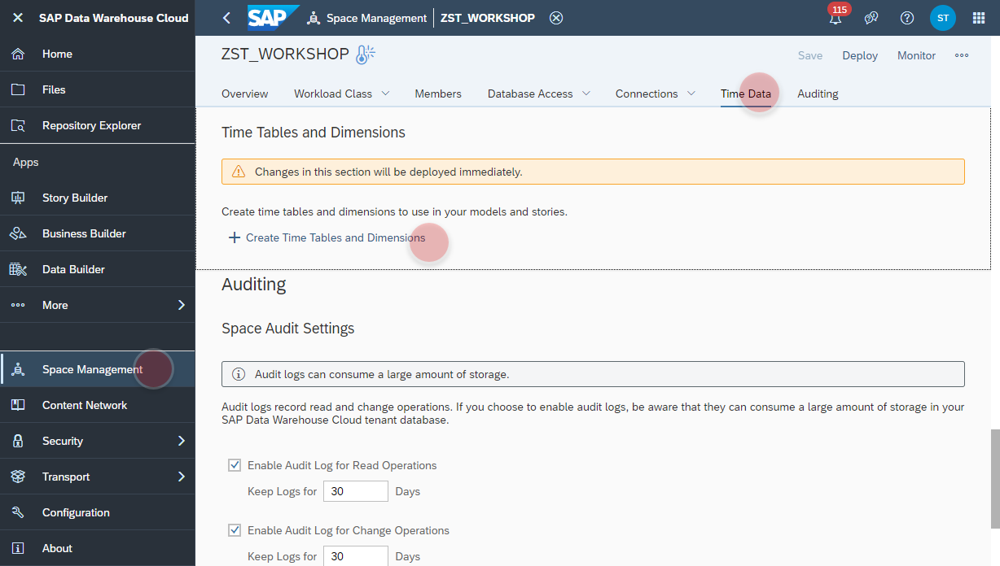
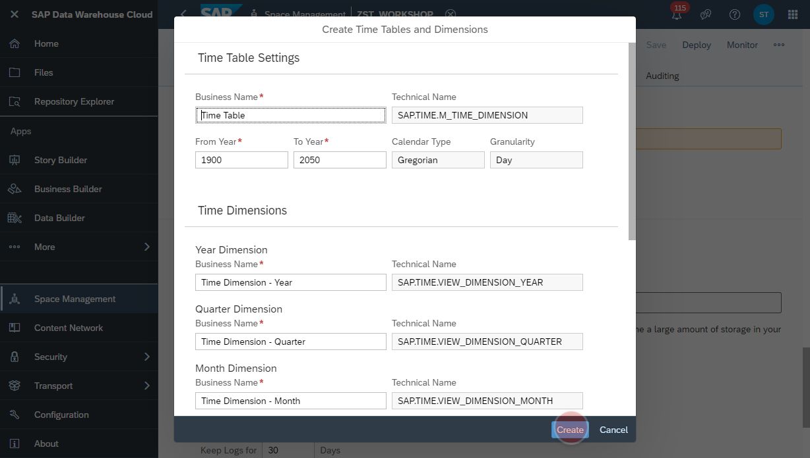

# Generate <i>Time</i> Tables and Views
The generation of the Time Tables and Views needs be applied only <b>once</b> per space. The generated views can be reused by all other models within the same space.

1. Navigate to the _Space Management_
2. Select the section <b><i>Time Data</i></b>.
3. Click on <b><i>Create Time Tables and Dimensions</i></b>
   
4. The dialog <b><i>Time Table Settings</i></b> will show up.
5. Keep all the default settings and click on <b><i>Create</i></b>-button
    
6. After successful generation, the corresponding tables and views can be found on in the <i><b>Repository Explorer</b></i>
    
  
