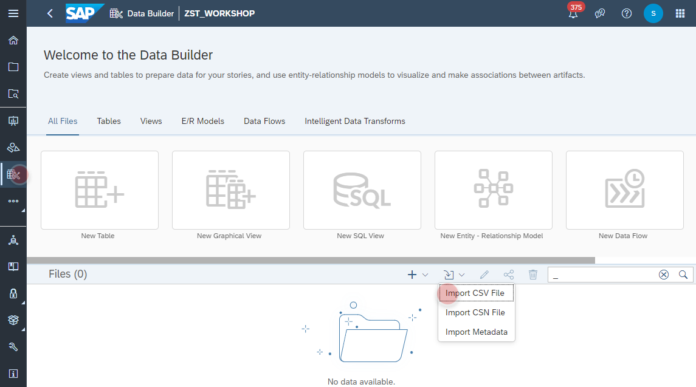
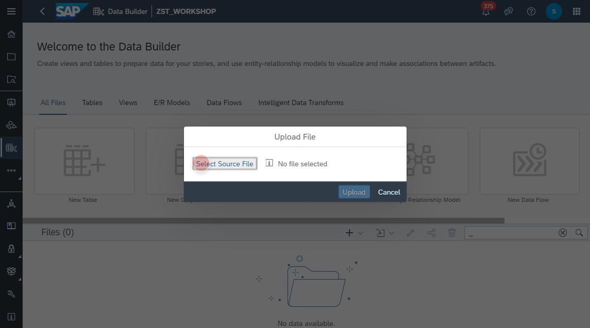
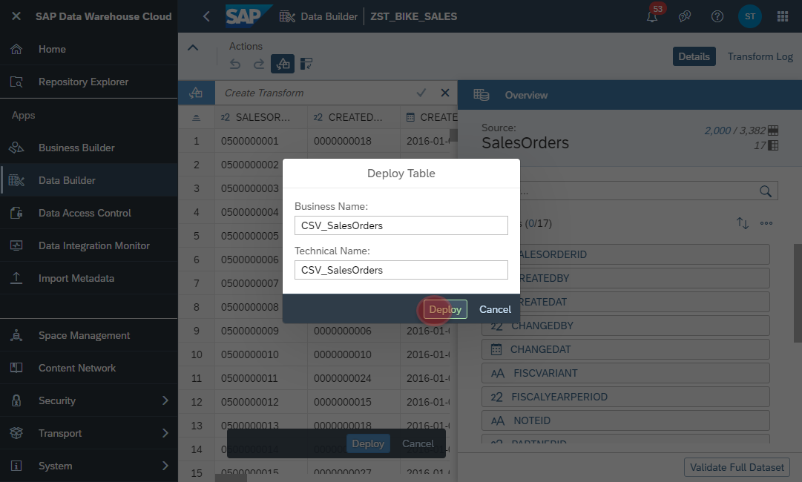

# Upload <i>Bike Sales</i> CSV Files
In this exercise, we will learn how to bring data into SAP Data Warehouse Cloud by uploading some sample datasets. This is a prerequiste for all follow-up exercises. 

1. Navigate to the Data Builder of SAP Data Warehouse Cloud
2. Click on the <b><i>Import CSV File</i></b>
  
3. Select a source file, e.g. SalesOrders.csv, Products.csv, etc. 
  
4. Click on <b><i>Upload</i></b>
  
5. In this page you will have the options to wrangle and adopt the data to your needs, e.g.:
    - Change Data Types
    - Concatenate different columns into one
    - Replace NULL values with appropriate value of your choice
    - etc.
6. For our exercise it's good enough to click on the <b><i>Deploy</i></b> Button to move on.
  
7. Set the name of the table, which will be created to store the data. In our example please add a prefix <b>CSV_</b> to the CSV filename, e.g. <b><i>CSV_SalesOrders</i></b>.
8. The click again on the <b><i>Deploy</i></b> Button
  
9. Please repeat these steps for all other downloaded CSV files 

   
