# Upload <i>Currency Conversion Sample Data</i> (ABAP TCUR*)

> 📘 **CSV File Upload and Data Wrangling**: More information about CSV file upload and Data Wrangling can be found in the [SAP Help site](https://help.sap.com/viewer/c8a54ee704e94e15926551293243fd1d/cloud/en-US/2509fe4d86aa472b9858164b55b38077.html).

1. Navigate to the Data Builder of SAP Data Warehouse Cloud
2. Click on the <b><i>Import CSV File</i></b>
    
3. Select the <i><b>TCURR.csv</b></i> as source file and click on Upload
    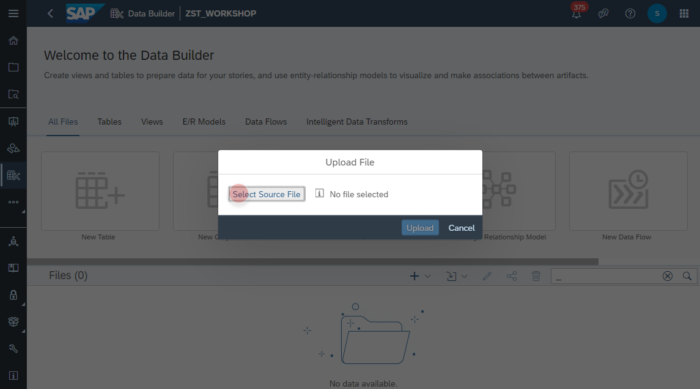
4. Adjust the column data types as the following:

    Column | Data Type
    ---------|---------
    MANDT | String
    KURST | String
    FCURR | String
    TCURR | String
    GDATU | String
    UKURS | Number
    FFACT | Integer
    TFACT | Integer
    
      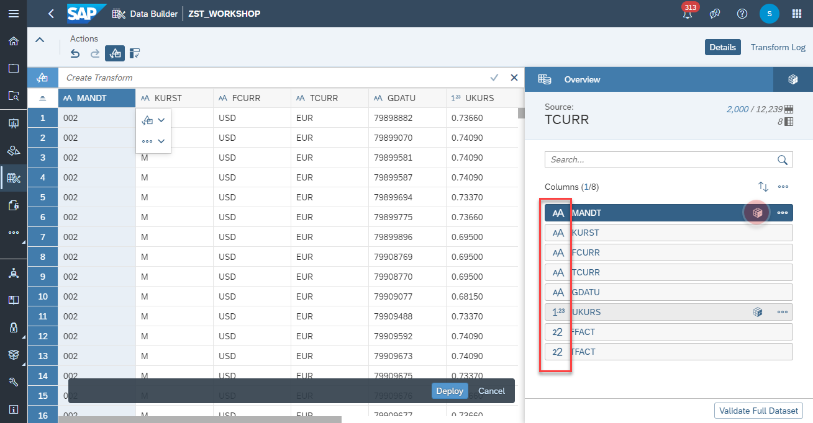
      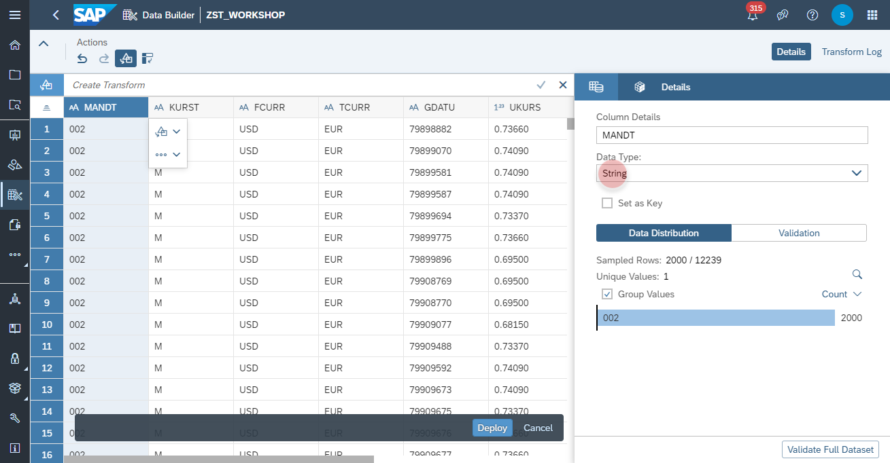
    
5. Click on Deploy to upload the file and create local table with the Business Name and Technical Name <b><i>CSV_TCURR</i></b>
      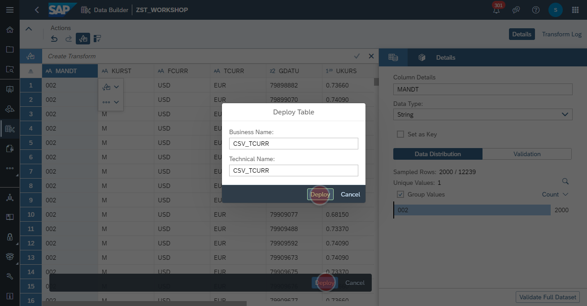

## Upload <i>Currency Prefactors</i> CSV file
1. Navigate to the Data Builder of SAP Data Warehouse Cloud
2. Click on the <b><i>Import CSV File</i></b>
    
3. Select the <i><b>TCURF.csv</b></i> as source file and click on Upload
    
4. Adjust the column data types as the following:

    Column | Data Type
    ---------|---------
    MANDT | String
    KURST | String
    TCURR | String
    GDATU | String
    FFACT | Integer
    ABWCT | String
    ABWGA | String

      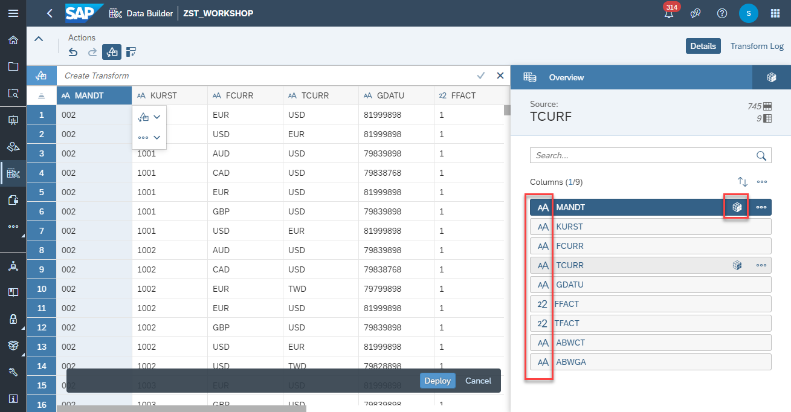
      

5. Click on Deploy to upload the file and create local table with the Business Name and Technical Name <b><i>CSV_TCURF</i></b>
      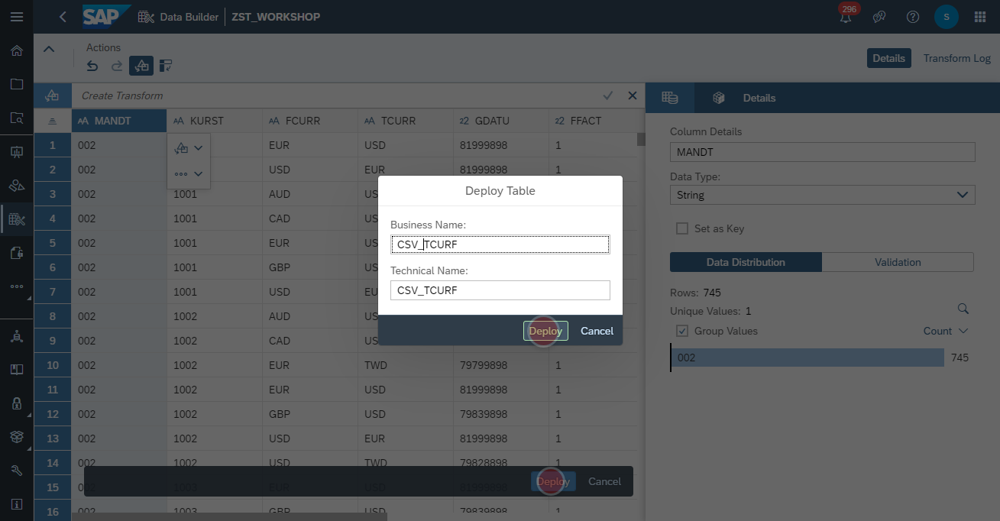

## Upload <i>Currency Configuration</i> CSV file
1. Navigate to the Data Builder of SAP Data Warehouse Cloud
2. Click on the <b><i>Import CSV File</i></b>
    
3. Select the <i><b>TCURV.csv</b></i> as source file and click on Upload
    
4. Adjust the column data types as the following:

    Column | Data Type
    ---------|---------
    MANDT | String
    KURST | String
    XINVR | String
    BWAER | String
    XBWRL | String
    GKUZU | String
    BKUZU | String
    XFIXD | String
    XEURO | String
    
      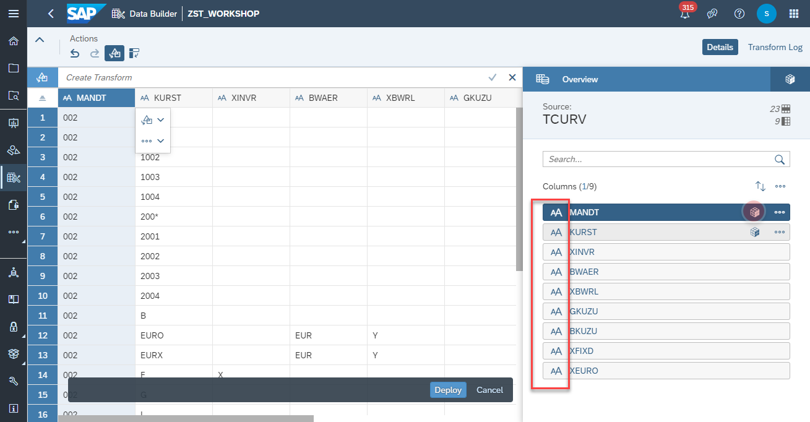
      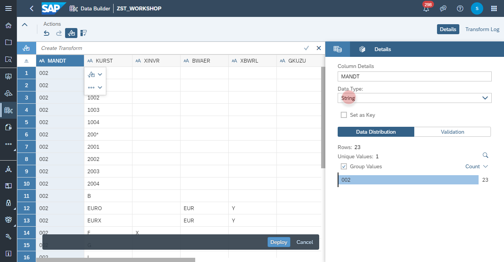

5. Click on Deploy to upload the file and create local table with the Business Name and Technical Name <b><i>CSV_TCURV</i></b>
      
        
## Upload <i>Currency Precisions</i> CSV file
1. Navigate to the Data Builder of SAP Data Warehouse Cloud
2. Click on the <b><i>Import CSV File</i></b>
    
3. Select the <i><b>TCURX.csv</b></i> as source file and click on Upload
    
4. Adjust the column data types as the following:

    Column | Data Type
    ---------|---------
    CURRKEY | String
    CURRDEC | String
        
      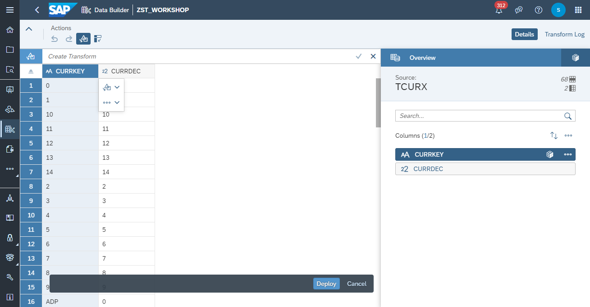

5. Click on Deploy to upload the file and create local table with the Business Name and Technical Name <b><i>CSV_TCURX</i></b>
      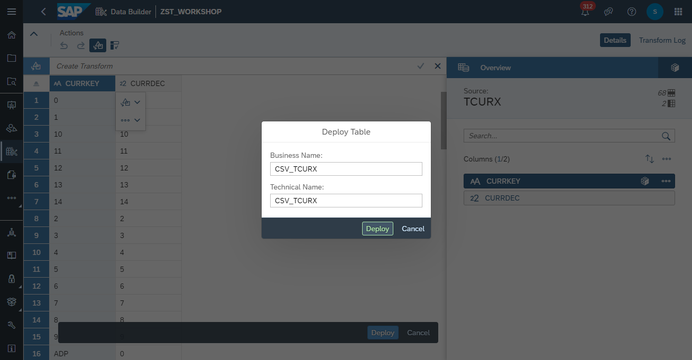
    

## Upload <i>Currency Conversion</i> Sample Data (ABAP TCUR* Tables)
1. Navigate to the Data Builder of SAP Data Warehouse Cloud
2. Click on the <b><i>Import CSV File</i></b>
    
3. Select the <i><b>SFLIGHT.csv</b></i> as source file and click on Upload
    
4. Adjust the column data types as the following:

    Column | Data Type
    ---------|---------
    MANDT | String
    CARRID | String
    CONNID | String
    FLDATE | Date
    PRICE | Number
    CURRENCY | String
    PLANETYPE | String
    SEATSMAX | Integer
    SEATSOCC | Integer
    PAYMENTSUM | Number
    SEATSMAX_B | Integer
    SEATSOCC_B | Integer
    SEATSMAX_F | Integer
    SEATSOCC_F | Integer
    
      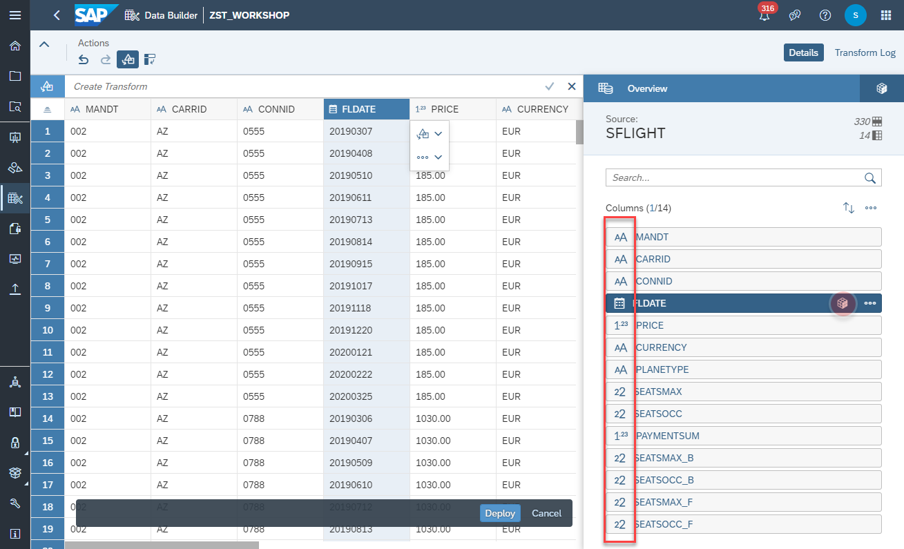
      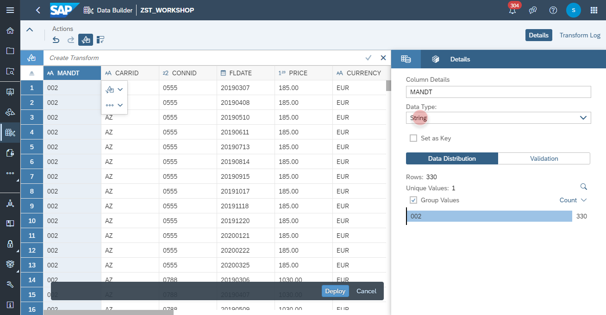

5. Click on Deploy to upload the file and create local table with the Business Name and Technical Name <b><i>CSV_SFLIGHT</i></b>
      
    
## Upload <i>Currency Notation</i> CSV file
1. Navigate to the Data Builder of SAP Data Warehouse Cloud
2. Click on the <b><i>Import CSV File</i></b>
    
3. Select the <i><b>TCURN.csv</b></i> as source file and click on Upload
    
4. Adjust the column data types as the following:

    Column | Data Type
    ---------|---------
    MANDT | String
    FCURR | String
    TCURR | String
    GDATU | String
    NOTATION | Integer
    
      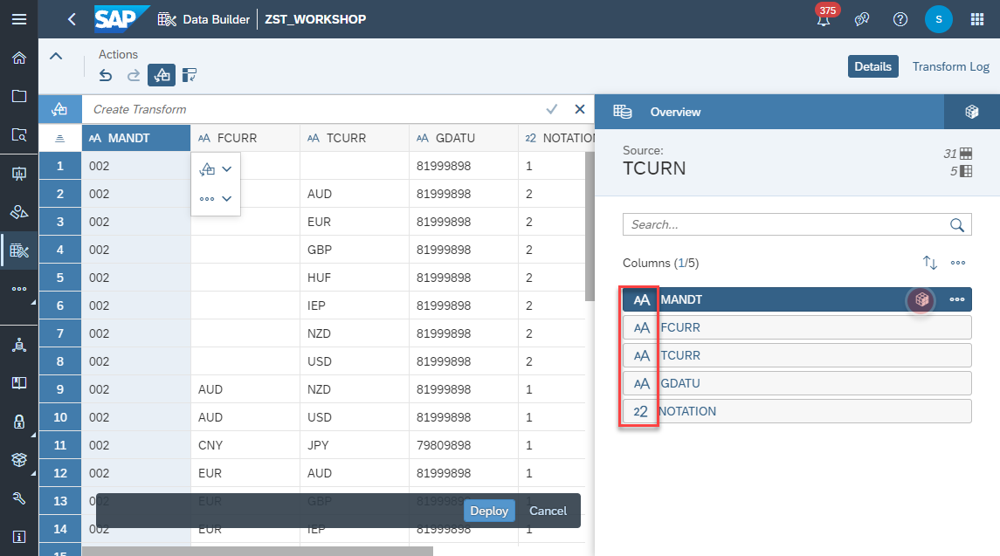
      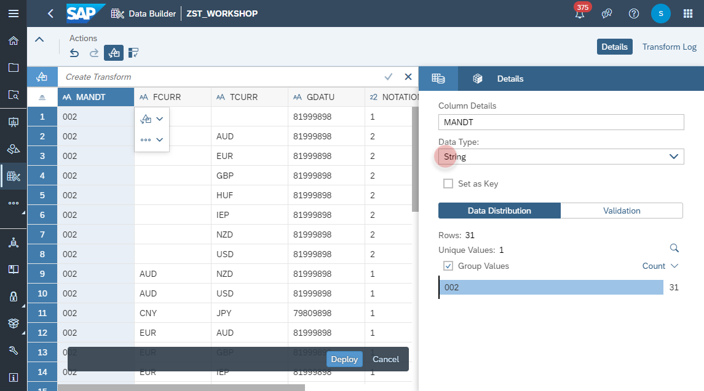
    
5. Click on Deploy to upload the file and create local table with the Business Name and Technical Name <b><i>CSV_TCURR</i></b>
      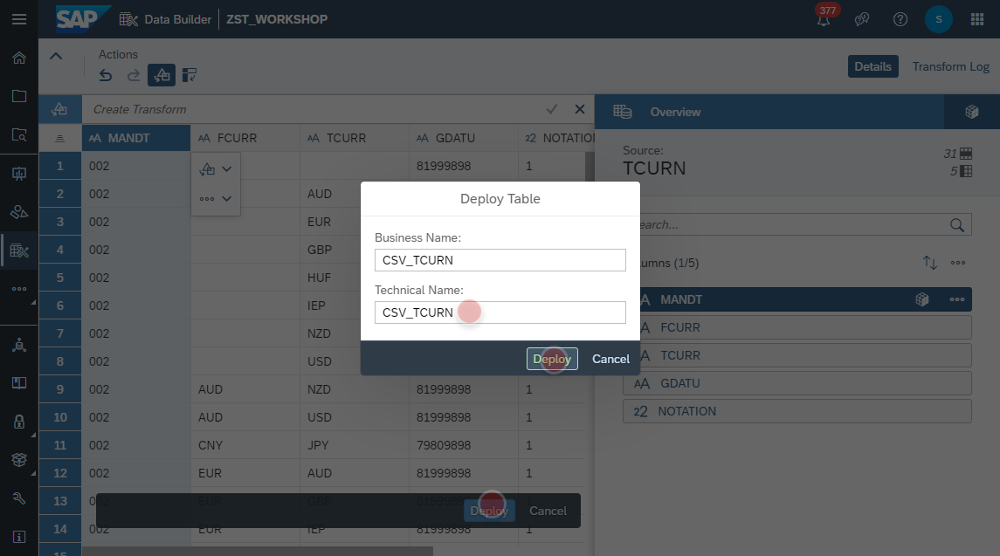
