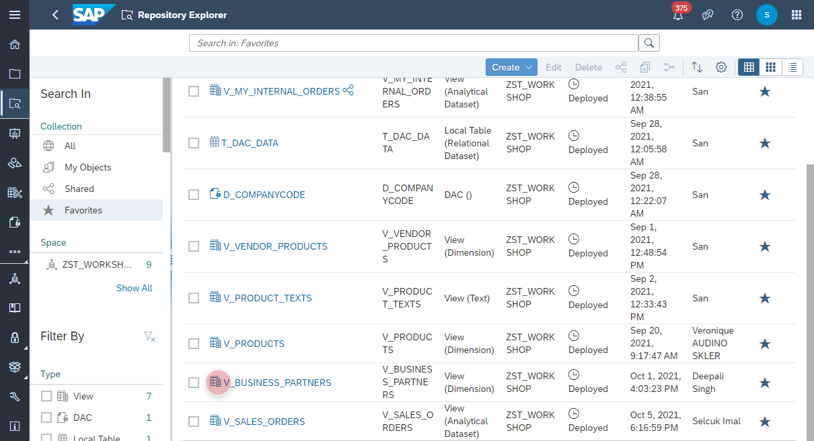
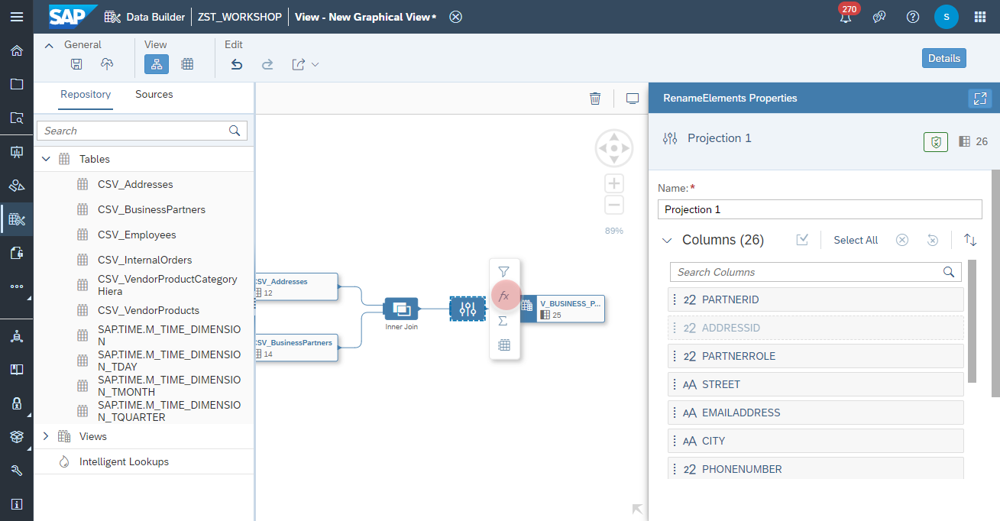
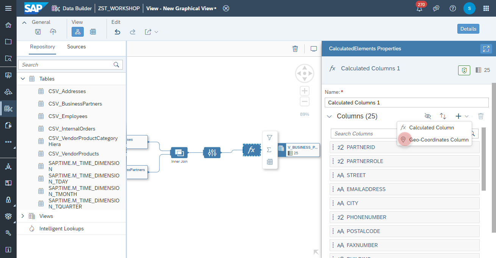
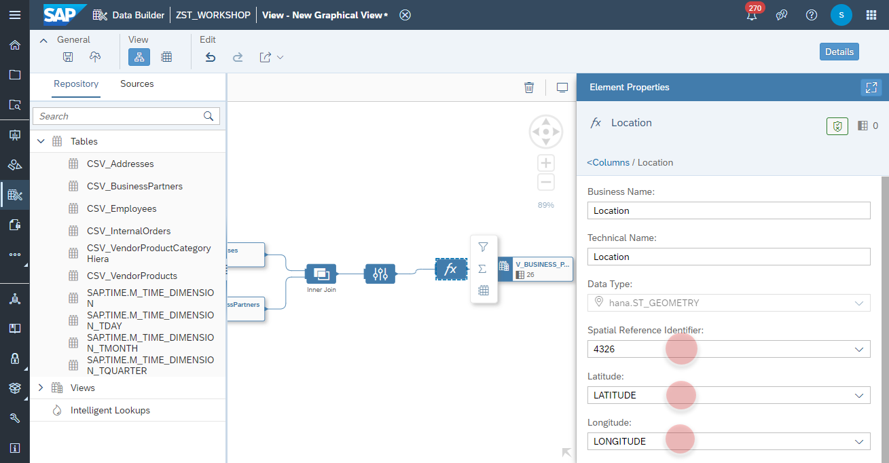
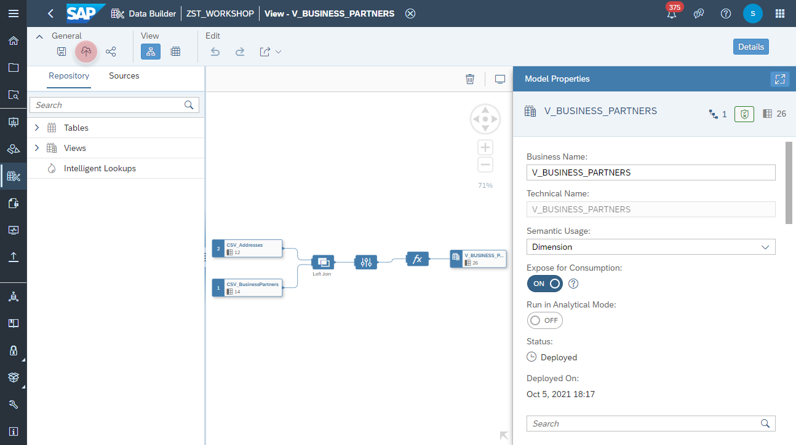

# Apply Geo Spatial on _Business Partners_ View
In this exercise we will apply Geo Spatial configuration on the view _**V_BUSINESS_PARTNERS**_. 

1. Navigate to the Repository Explorer
2. Search and edit the view _**V_BUSINESS_PARTNERS**_
    

3. Select the *Projection Node* and add a new **Calculation Node** from the context menu
    
4. Add a new **Geo-Coordinates Column**.
    
5. Adjust the Calculated Column as following:
    - Business Name: **LOCATION**
    - Technical Name: **LOCATION**
    - Data Type: **hana.ST_GEOMETRY
    - Spatial Reference Identifier: **4326**
    - Latitude: **LATITUDE**
    - Longitude: **LONGITUDE** 
    

6. Click on <b>Deploy</b> button to deploy the view
    
