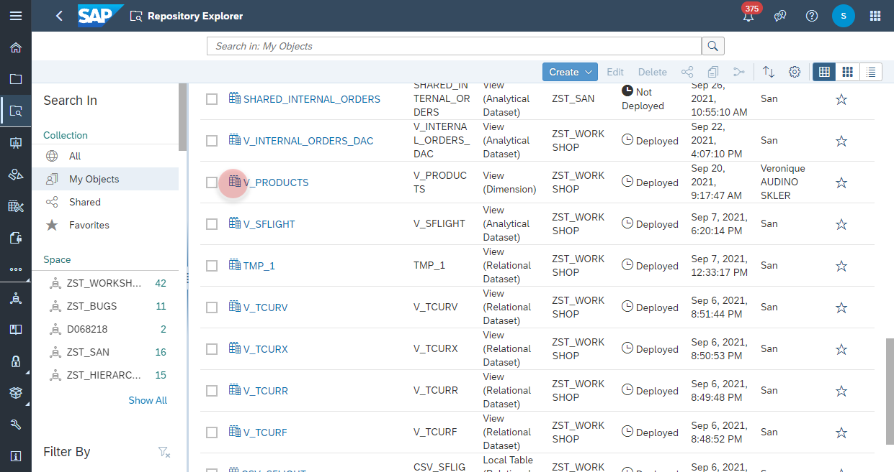
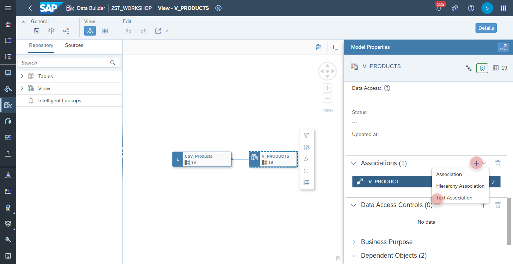
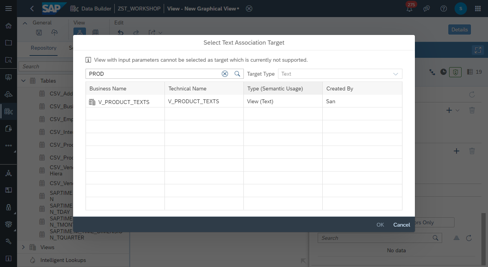
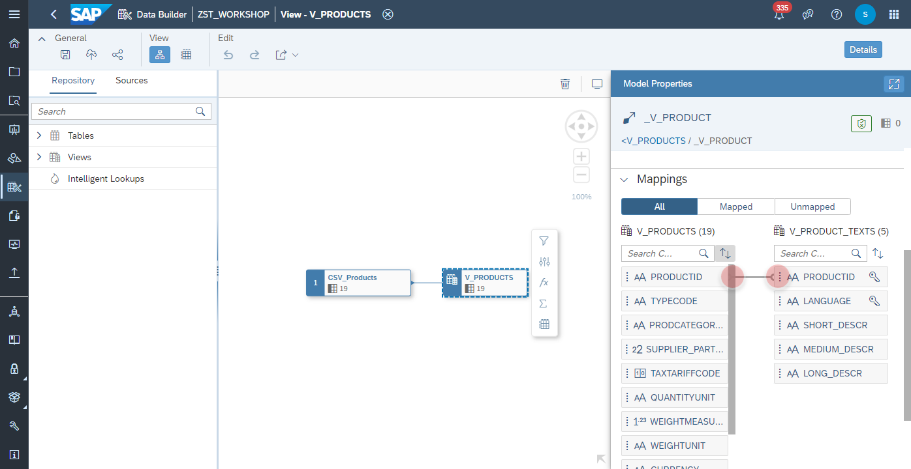
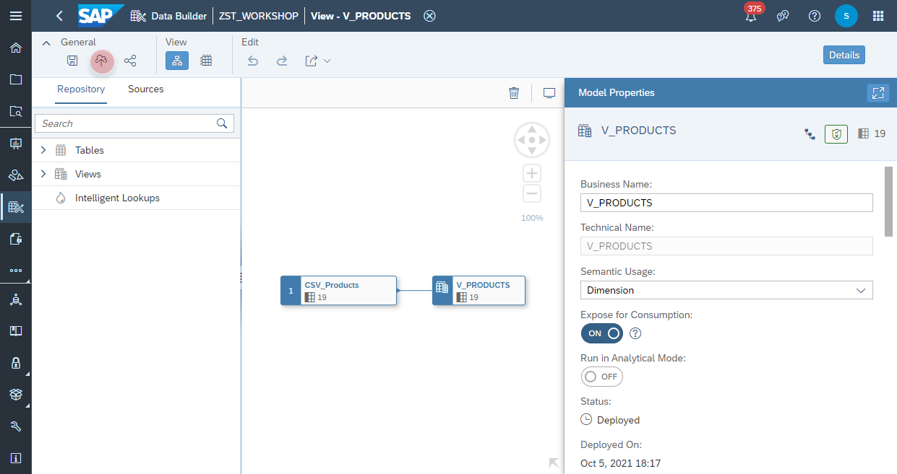

# Create <i>Text Association</i>

1. Navigate to the Repository Explorer
2. Search and edit the view **V_PRODUCTS**
       
3. Add a new <b>Text Association</b> from the <i>Association</i> section  
   

4. Find and select the view <b>V_PRODUCT_TEXTS</b>
    

5. Map the column <b>V_PRODUCTS.PRODUCTID</b> and column <b>V_PRODUCT_TEXTS.PRODUCTID</b>
    

6. Click on <b><i>deploy</i></b> button to deploy the view
    
