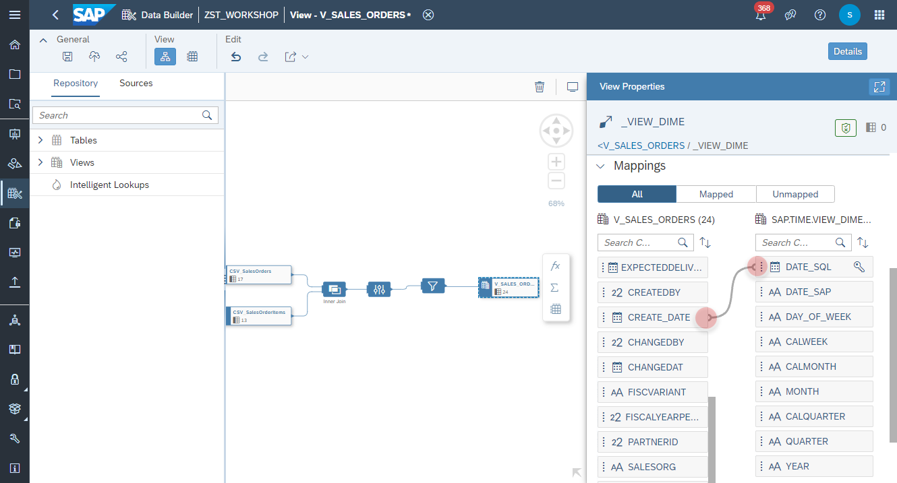

# Create <i>Sales Orders</i> View

### Analytical Dataset
1. Navigate to the Repository Explorer
2. Click on **Create - Graphical View** button to create a new view
    
3. Click on **Details** button and configure the following properties:
  - Business Name: **V_SALES_ORDERS**
  - Technical Name: **V_SALES_ORDERS**
  - Semantic Usage: **Analytical Dataset**
  - Expose for Consumption: **ON**
      

### Join Node
3. Drag and drop the table **CSV_SalesOrderItems** into the canvas
    
4. Drag and drop the table **CSV_SalesOrders** into the canvas and drop it on the *CSV_SalesOrderItems**
5. Create a new **Join Node** from the context menu 
    
7. Map the column **CSV_SalesOrderItems.SALESORDERID** with the column **CSV_SalesOrders.SALESORDERID**
    

### Filter Node
8. Select the *Projection Node* and add a new **Filter Node**
    

9. Adjust the filter as the following:
    - Name: **Filter 1**
    - Expression: **SALESORG in ('EMEA', 'AMER')**
        
      
10. Select the *Filter Node* and click on **Data Preview** from the context menu. Please check if the preview is showing the correct data for the defined filter.  
         
 
### Association
11. Select the *Output Node* and add a new **Association** from the *Association Section*. 
    
12. Find a select the view **V_PRODUCTS**
    
13. Map the column **V_SALES_ORDERS.PRODUCTID** with the column **V_PRODUCTS.PRODUCTID**
    
14. Select the *Output Node* and add a new **Association** from the *Association Section*. 
    
15. Find a select the view V_BUSINESS_PARTNERS
    
16. Map the column **V_SALES_ORDERS.PARTNERID** with the column **V_BUSINESS_PARTNERS.PARTNERID**
    
  
### Asscociating Time Dimension

  >:triangular_flag_on_post: **Note 4th-Oct-2021**: In order to use a time dimension in SAP Analytics Cloud, you must create your dimension by following the procedure at Creating Time Dimensions. Manually-created or other time dimensions may not function correctly.
>
>In addition, attributes in an analytical dataset that are mapped to a time dimension via an association must have technical names that respect the following naming conventions:
*_DATE for Date/Day level
*_CALMONTH for Month level
*_CALQUARTER for Quarter level
*_YEAR for Year level
  >https://help.sap.com/viewer/c8a54ee704e94e15926551293243fd1d/cloud/en-US/5aae0e95361a4a4c964e69c52eada87d.html

17. Select the _Project Node_ and select the column **CREATDAT** to rename.
      

18. Rename the Business and Technical Name of the column to **CREATE_DATE**.
    

19. Select the *Output Node* and add a new **Association** from the *Association Section*. 
    
20. Find a select the view **SAP.TIME.VIEW_DIMENSION_DAY** (Time Dimension-Day)
    
21. Map the column **V_SALES_ORDERS.CREATE_DATE** with the column **SAP.TIME.VIEW_DIMENSION_DAY.DATE_SQL**
    

### Measures
22. In the *Output Node* change the following attributes to **Measure**:
  - **GROSSAMOUNT**
  - **NETAMOUNT**
  - **TAXAMOUNT**
  - **QUANTITY**
      
      
  
23. Click on **Deploy** button to deploy the view. Please check the **Status** after successful deployment.
    

