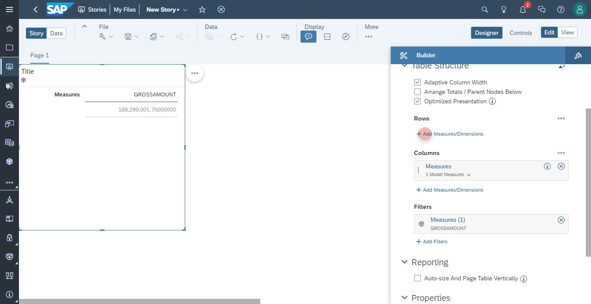
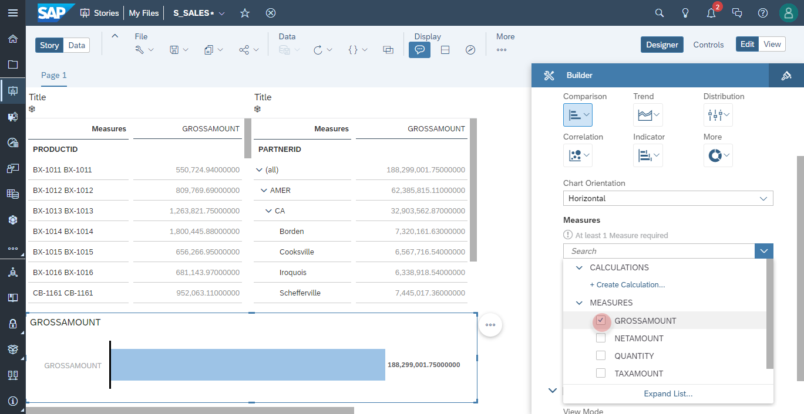
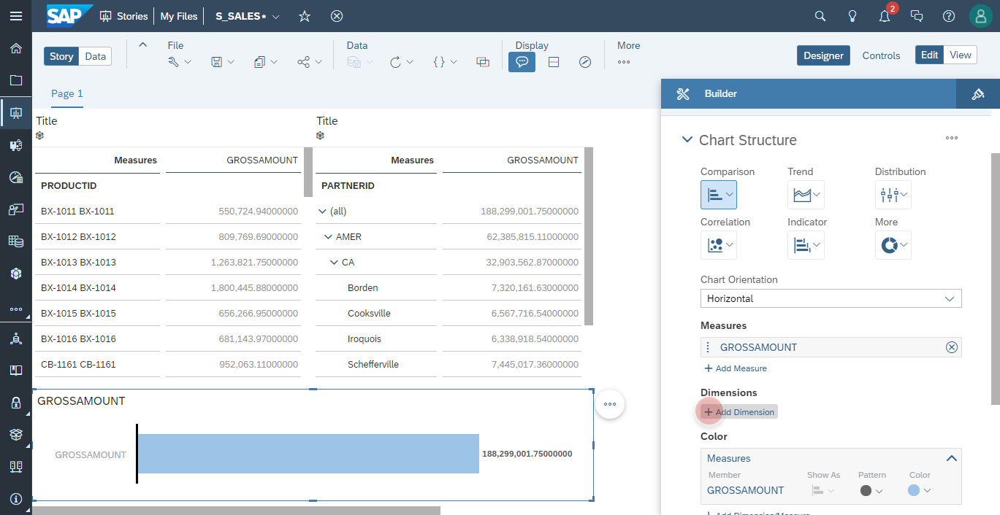
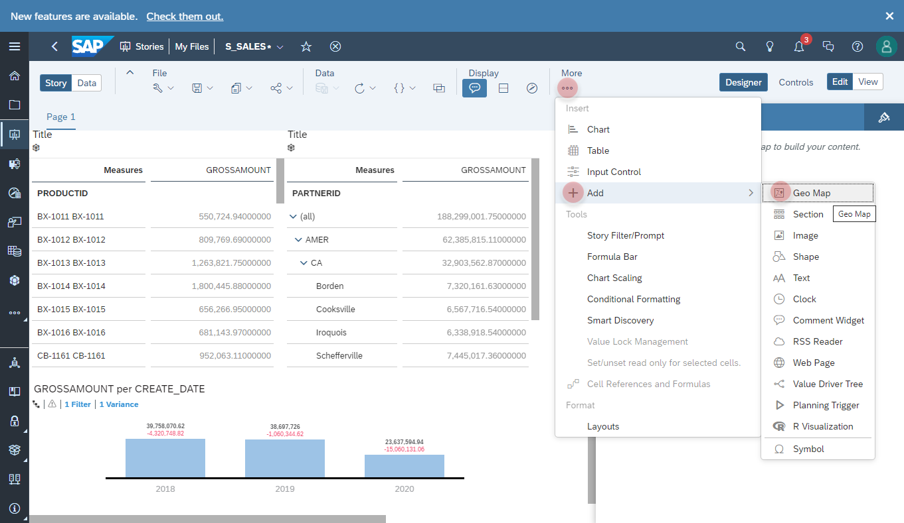
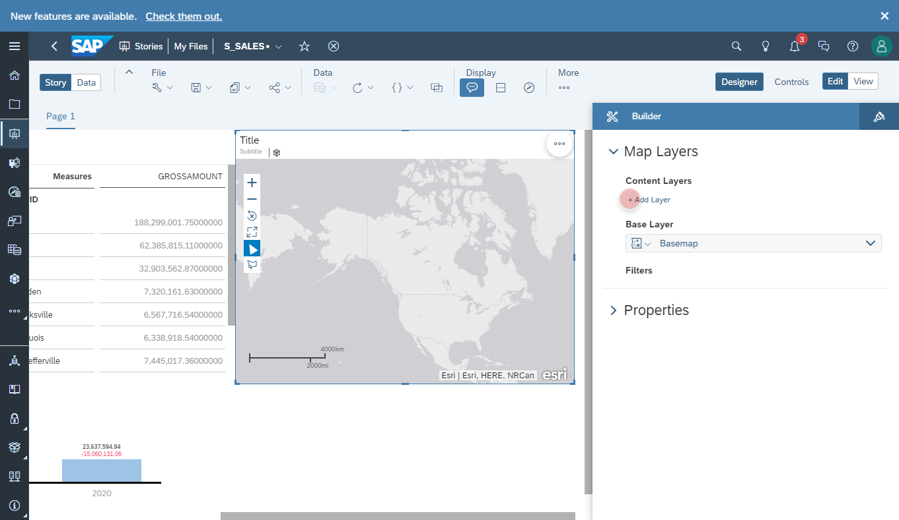

# Create Sales Story in SAP Analytics Cloud

1. In SAP Analytics Cloud navigate to **Stories** to add a new **Canvas**
    

2. Click on **Add Data** button
   

3. Click on **Data from a Data Source** 
    

4. Click on **Connect to Live Data** and select your *SAP Data Warehouse Cloud* instance
    

5. Select your Space, e.g. **ZST_WORKSHOP**
    

6. Select the model **V_SALES_ORDERS**
    

7. Add the object **Table** into the canvas
    
  
8. Select the *table* object and make sure that the measure **GROSSAMOUNT** is by default in the **Filters** section 
9. Add new **Measures/Dimensions** into the **Rows**
    
 
10. Select the column **PRODUCTID**
    

### Display ID and Description

11. For the column **PRODUCTID** set the display option to **ID and Description**.
    

### Save the Story
12. Click on the **Save** button on the toolbar.
    

13. As the name for the story, please enter **S_SALES**.
    

### Change the Data Access Language 
14. Select the **Profile Settings**.
  

15. Change the **User Preferences** as the follwoing and click on **Save** button to confirm:
  - Data Access Language: **Deutsch** (German)
    

16. Please check the description language of **PRODUCTID RC-1055** has been changed its language to German with description *Rennsemmel*.  
    

### Level Based Hierarchy
17. Add a new **Table** into the canvas.
    

18. Add new **Measures/Dimensions** into the **Rows** section
    

19. Select the column **PARTNERID**.
    

20. Expand the **Hierarchy** on the table. Please validate the the hieararhcy is organized by **REGION**, **COUNTRY**, **CITY**.
    

### Time Series
21. Add a new **Chart** into the canvas.
    
  
22. Add a new **Measure** into the chart.  
    
  
23. Select the column **GROSSAMOUNT**.  
    
  
24. Add new **DIMENSION** into the dimensions section.  
    
  
25. Select the column **CREAT_DATE**.  
    
  
26. Click on the **Hierarchy** button on the chart and set the level to **Level 2**.  
    

27. In the Filters section add a new **Range Filter** for **CREATE_DATE** 
    

28. Set the the **Look Back** property to **3**.
    
  
29. Open the context menu of the chart, and click on **Compare To - Previous Year**.
    

30. A new variance calculation will be added to the chart, which you can always change from the **Variance section**.
    

### Geo Spatial
28. Add a new **Geo Map** into the canvas.
    
  
29. Add a new **Layer** into the Geo Map.
    
  
30. Set Layer Type to **Bubble Layer** and add a new **Location* Dimension*
    
  
31. Select the column **Location**. 
    
  
32. Add a new **Measure** for **Bubble Size**.  
    
  
33. Select the column **GROSSAMOUNT**.  
   
  
34. Add a new **Measure** for **Bubble Color**.  
    
  
35. Select the column **QUANTITY**.   
   

### Save the Story 

36. Click on **Save** button to save the story **S_SALES**.
    

