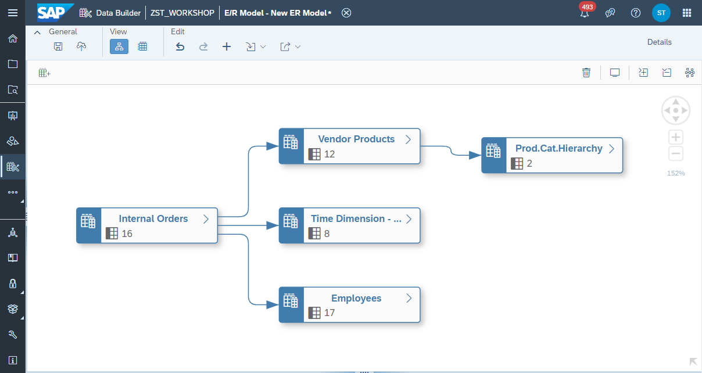
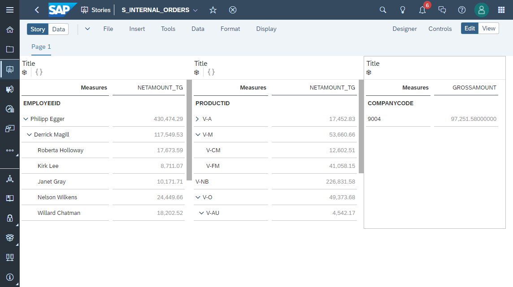

# Exercise 3 - Internal Orders

In this exercise, you're going to build up a reporting in Internal Orders to answer the questions:
- What is the Order Volume per Employee?
- What is the Order Volume per Product Category?
- What is my own Order Volume?
- What is the Sales Revenue per Location?

Along the exercise you will learn about advanced concepts and features such as Currency Conversion, Parent Child Hierarchy and applying Data Access Control.

- [**Exercise 3.1 - Create Employee View**](/exercises/ex3/employees-view)
   - Parent Child Hierarchy (Internal)
- [**Exercise 3.2 - Create Vendor Product Category Hierarchy View**](/exercises/ex3/vendor-product-category-hierarchy-view)
   - Parent Child Hierarchy (External), Standalone Hierarchy  
- [**Exercise 3.3 - Create Vendor Products View**](/exercises/ex3/vendor-products-view)
   - [Exercise 3.3.1 - Create Hierarchy Association](/exercises/ex3/vendor-products-hierarchy-association)
      - Hierarchy Association 
- [**Exercise 3.4 - Create Internal Orders View**](/exercises/ex3/internal-orders-view)
   - [Exercise 3.4.1 - Wrap Currency Tables as Views](/exercises/ex3/currency-wrapper-view)
   - [Exercise 3.4.2 - Apply Currency Conversion](/exercises/ex3/internal-orders-currency-conversion)
      - Calculation Node 
   - [Exercise 3.4.3 - Input Parameters](/exercises/ex3/internal-orders-input-parameter)
- [**Exercise 3.5 - Create My Orders View**](/exercises/ex3/my-orders-view)
   - [Exercise 3.5.1 - Create Company Code Data Access Control](/exercises/ex3/data-access-control)
      - Data Access Control  
   - [Exercise 3.5.2 - Use Data Access Control](/exercises/ex3/my-orders-dac)
   - [Exercise 3.5.3 - Maintain Data for a Data Access Control](/exercises/ex3/maintain-dac-data)
   - [Exercise 3.5.4 - SAC Story Filter](/exercises/ex3/my-orders-sac-story-filter)
- [**Exercise 3.6 - Create Internal Orders Story in SAP Analytics Cloud**](/exercises/ex3/internal-orders-story)

 
 

