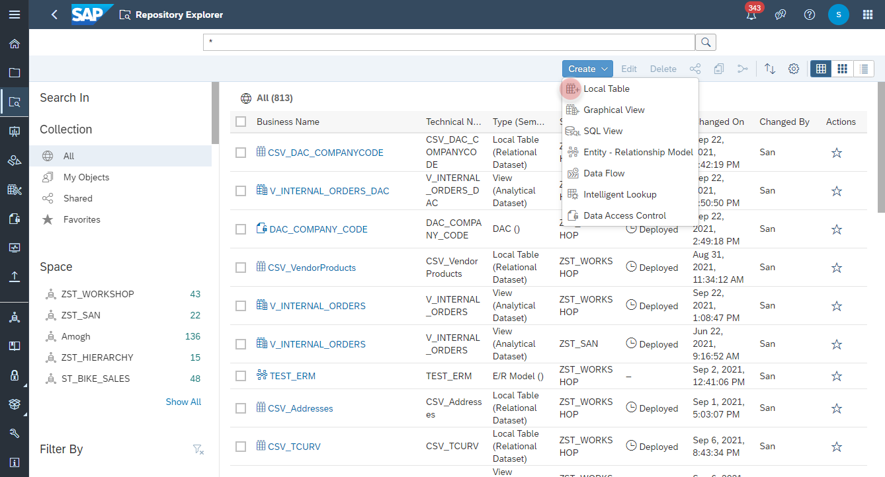
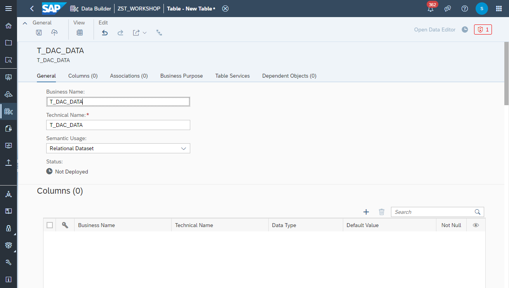
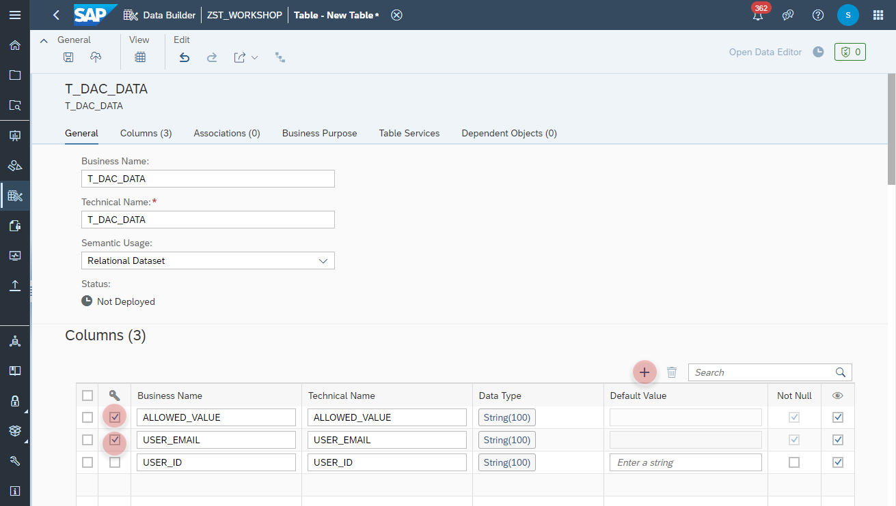
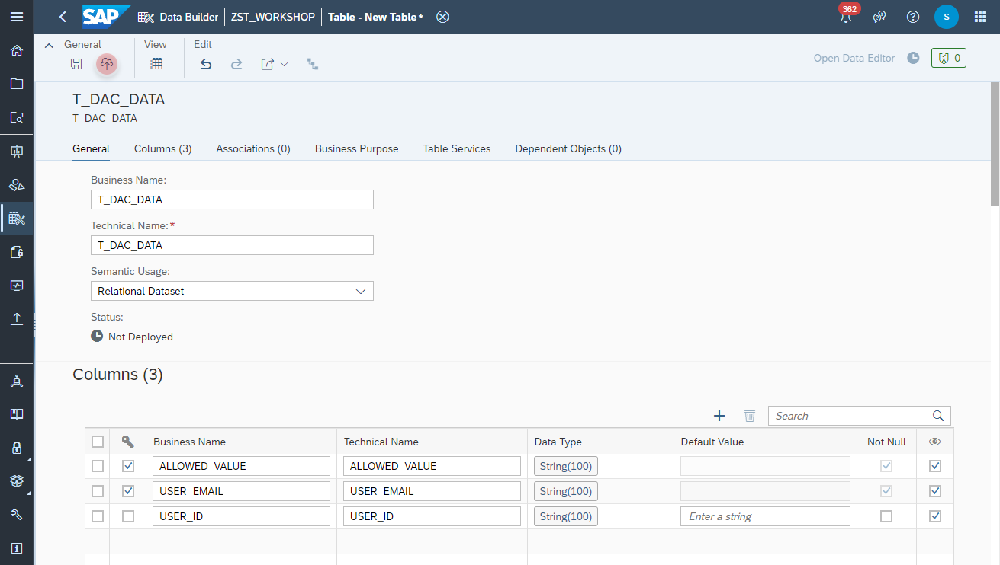
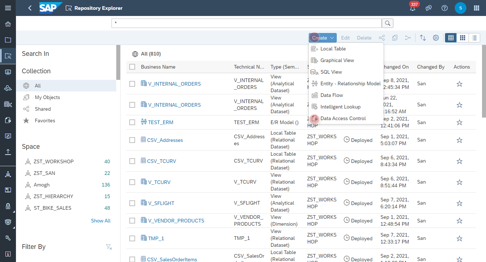
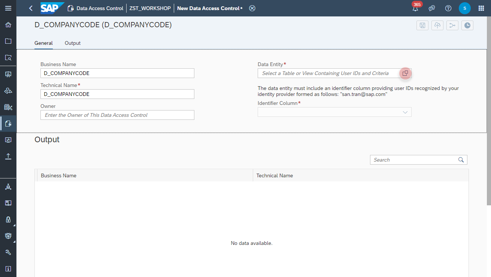
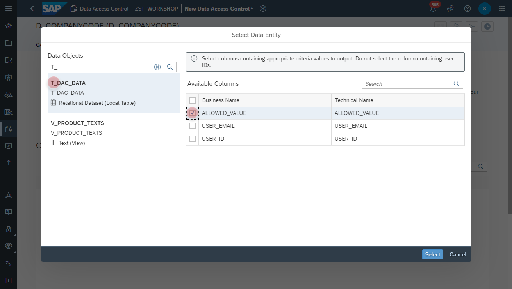
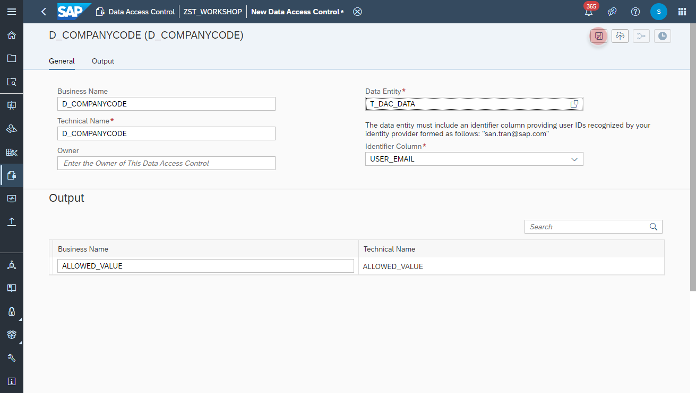

# Create Company Code Data Access Control

In this exercise we will create a **Data Access Control** and apply it on the data models. 
>:mortar_board: **Data Access Control**: Data access controls allow you to apply row-level security to your objects. When a data access control is applied to a data layer view or a business layer object, any user viewing its data will see only the rows for which they are authorized, based on the specified criteria. The Data Access Control acts like a **Lock**. Once defined, it can be attached to your data models to guard them from unauthorized data access.
>
>For more information please see the [SAP Help site](https://help.sap.com/viewer/c8a54ee704e94e15926551293243fd1d/cloud/en-US/a032e51c730147c7a1fcac125b4cfe14.html).
 

## Create Table for Data Access Control 
In the first step you define a local table, which contains the allowed value for a user.

1. Navigate to the Repository Explorer
2. Click on _**Create - Local Table**_ Button to create a new view
    
3. Configure the following properties on the **General** section:
    - Business Name: **T_DAC_DATA**
    - Technical Name: **T_DAC_DATA**
    - Type: **Relational Dataset**
    
  
4. Add the following columns in the **Columns** section:
    Primary Key | Column Name | Data Type
    ---|---|---
    Yes | ALLOWED_VALUE | String (100) 
    Yes | USER_EMAIL | String (100)
    No | USER_ID | String (100)
    
      
  
5. Click on the **Deploy** button to deploy the table.
    
  

## Create Data Access Control
In this step, we are creating the _Data Access Control_ object and specify the critera for access per user.

1. Navigate to the Repository Explorer
2. Click on _**Create - Data Access Table**_ button to create a new data access control.
    
3. Configure the following input:
    - Business Name: **D_COMPANYCODE**
    - Technical Name: **D_COMPANYCODE**
    - Data Entity: **T_DAC_DATA**
    - Identifier Column: **USER_EMAIL**
    - Output: **ALLOWED_VALUE**
    
       
       
4. Click on the **Deploy** button to apply the changes.
      
  

