# Create <i>Employees </i> Data Flow

1. Navigate to the Repository Explorer
2. Click on **Create - Data Flow** button to create a new view
  <br><br>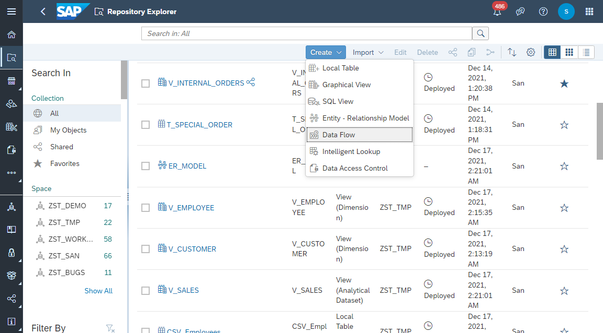
3. Click on **Details** button and configure the following properties:
  - Business Name: **DF_EMPLOYEES**
  - Technical Name: **DF_EMPLOYEES**
  <br><br>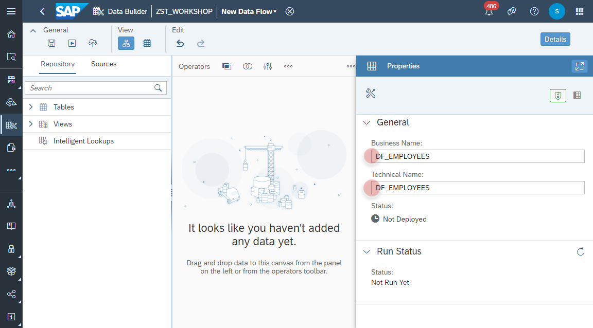

4. Drag and Drop the table **CSV_EMPLOYEES** into the canvas and set the type to **_Source_**. 
  <br><br>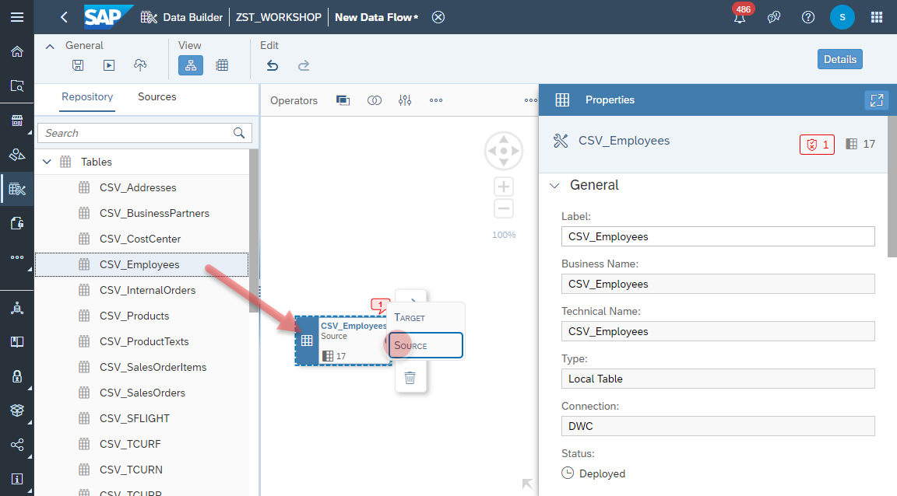

5. Add a new _Script_ Operator from the menu. The name is defaulted to **Script 1**.
  <br><br>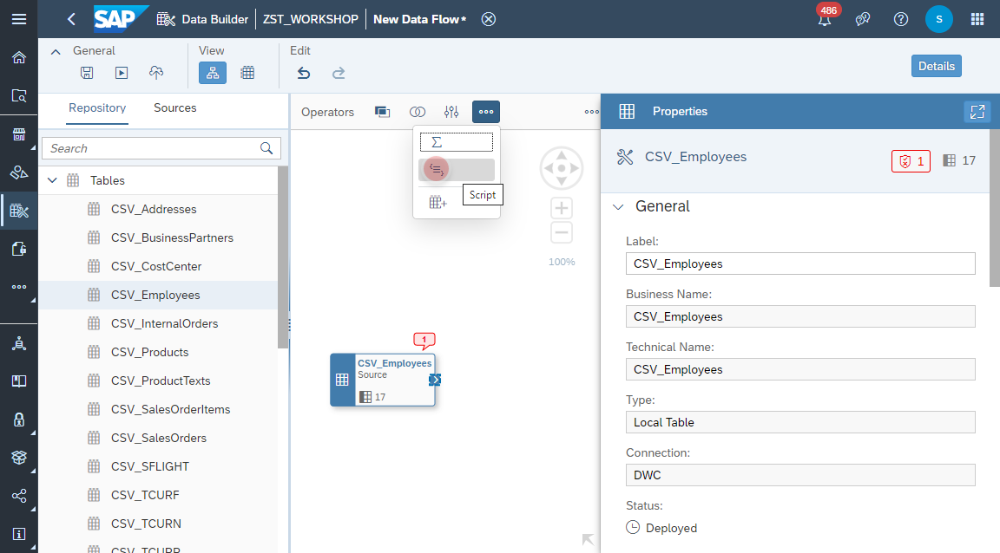

6. Select the source operator **CSV_EMPLOYEES** and add a new _Link_ to the operator **Script 1**.
  <br><br>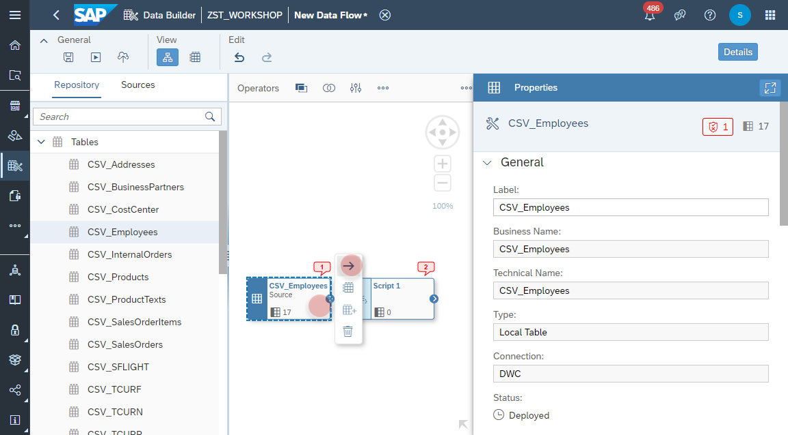
  <br><br>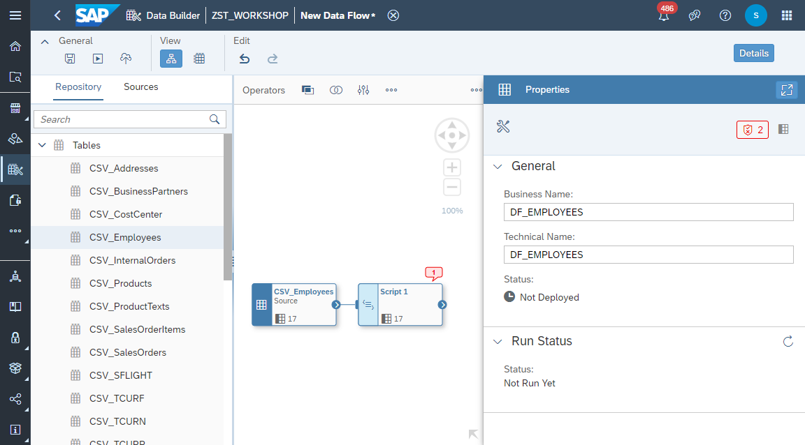

7. Select the operator **Script 1** and create a new column from the menu.
  <br><br>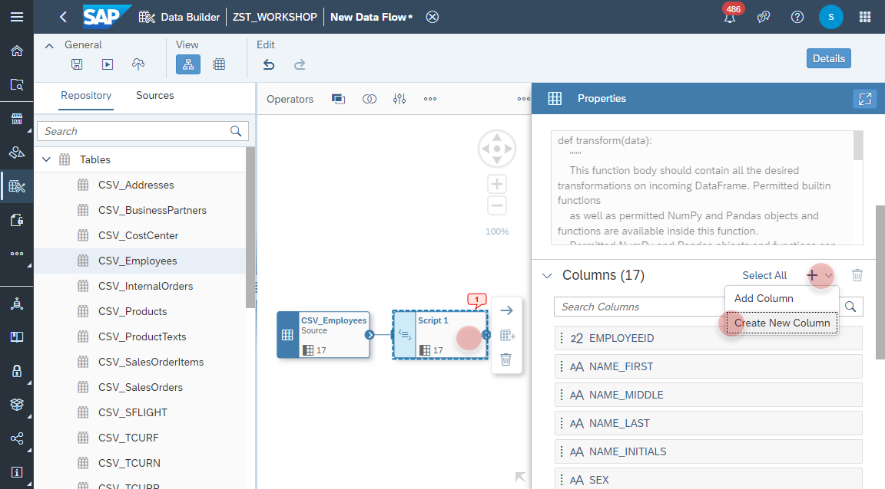

8. Maintain the fields as the following and click on _Save_ button.
  - Name: **FULL_NAME**
  - Data Type: **string**
  - Length: **30**
  <br><br>
  

9. Click on the _Edit_ button.  
  <br><br>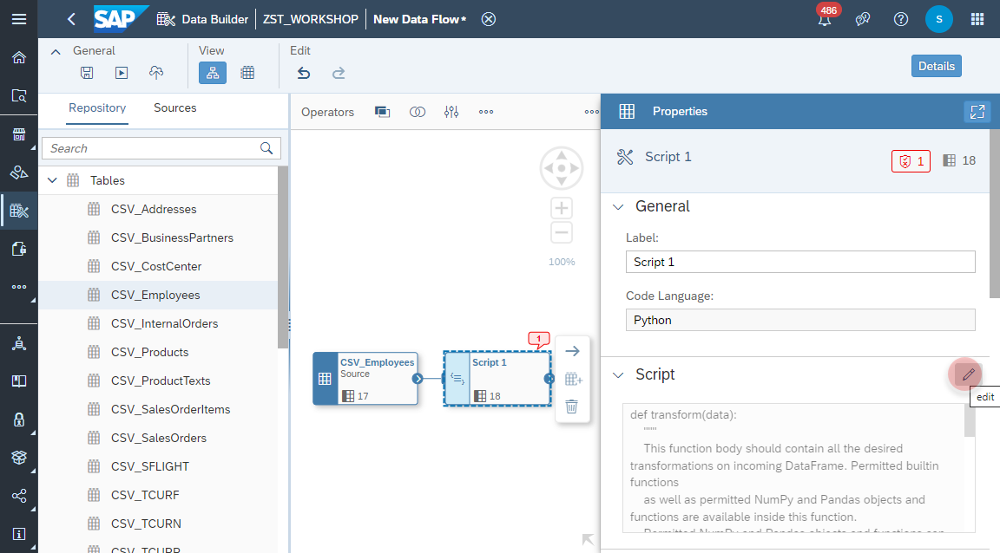

10. Insert the following script.
    ```
    #####################################################
    # Provide the function body for data transformation #
    #####################################################
    data["FULL_NAME"] = (data["NAME_FIRST"] + ' ' + data["NAME_LAST"])   
    return data
    ```
    


11. Add a new _Table_ from the menu.
  <br><br>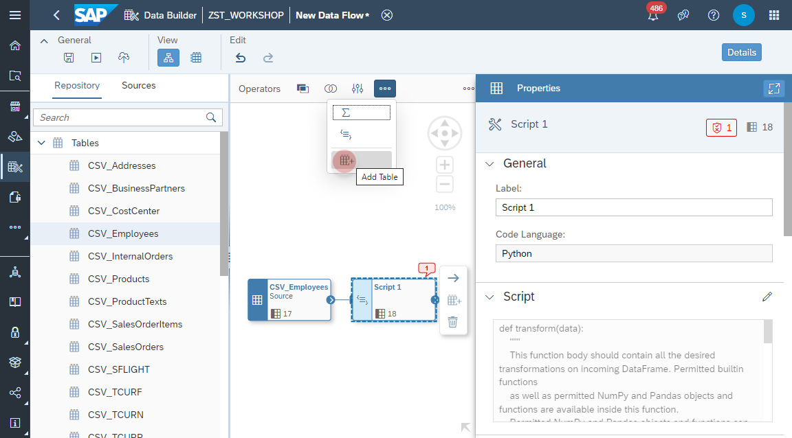
  
12. Select the operator **Script 1** and add a _Link_ to the table.
  <br><br>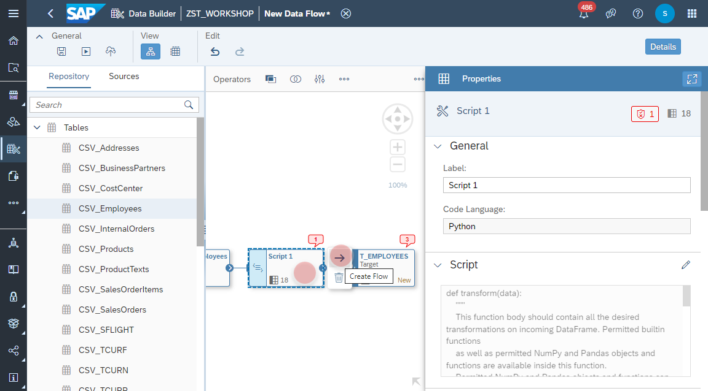

13. Select the operator table and maintain the following fields
  - Business Name: **T_EMPLOYEES**
  - Technical Name: **T_EMPLOYEES**
  and click on the _Create and Deploy Table_ button.
  <br><br>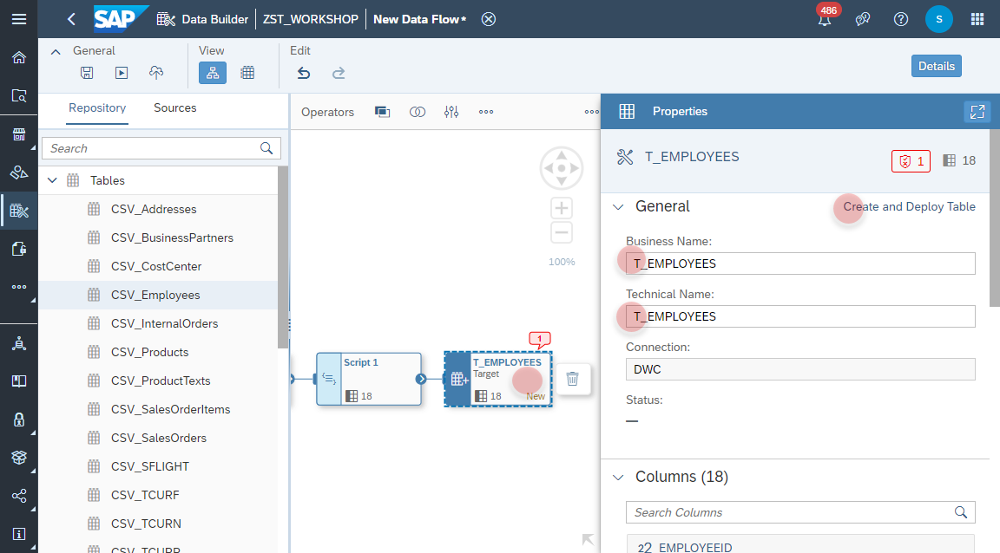

14. Once the table **T_EMPLOYEES** is created, change the update mode to **TRUNCATE**. 
  <br><br>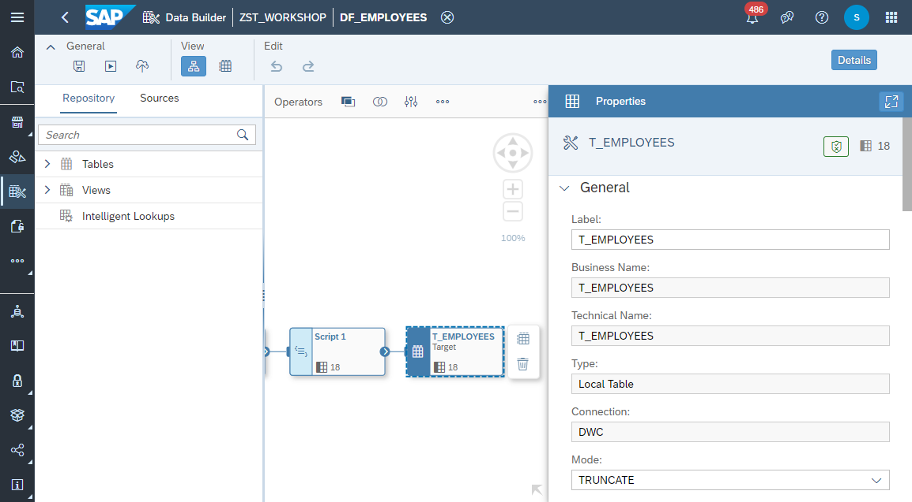

15. Click on _Save_ and _Deploy_ button.
  <br><br>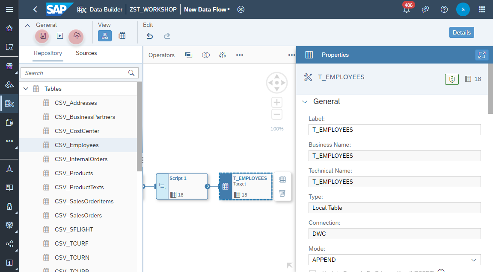
  
16. Click on _Run_ button to run the data flow. Make sure that the process is completed by click on the _Refresh_ button.
  <br><br>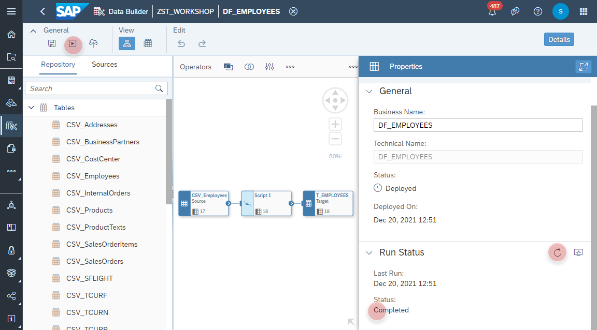

17. Select the target table operator and click on _Preview Data_ from the context menu. Validate the result of the column **FULL_NAME**.
  <br><br>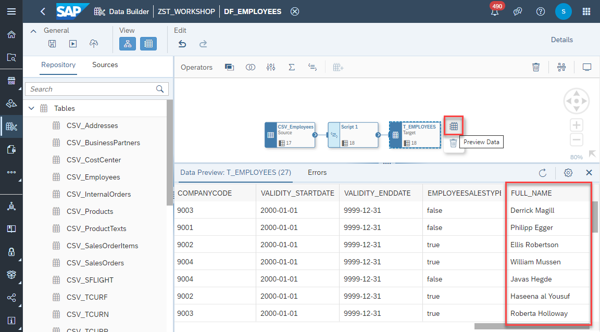
 


