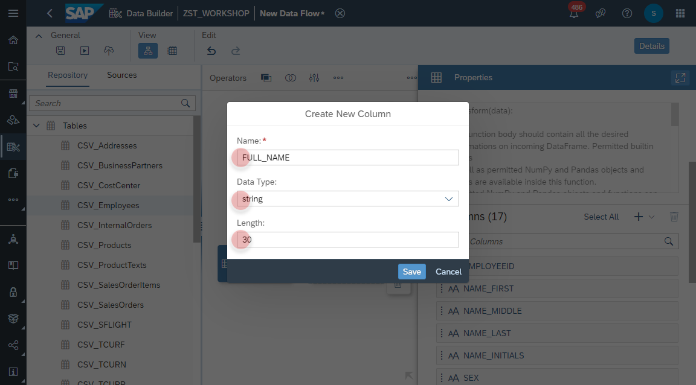
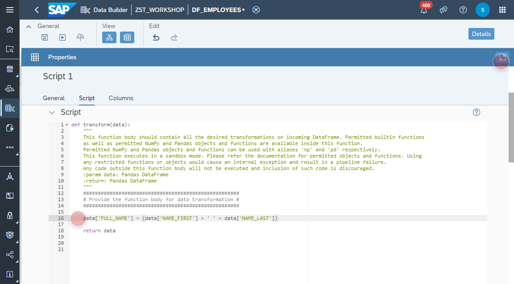

# Create <i>Employees </i> Data Flow

1. Navigate to the Repository Explorer
2. Click on **Create - Data Flow** button to create a new view
    
3. Click on **Details** button and configure the following properties:
  - Business Name: **DF_EMPLOYEES**
  - Technical Name: **DF_EMPLOYEES**
    

4. Drag and Drop the table **CSV_EMPLOYEES** into the canvas and set the type to **_Source_**. 
    

5. Add a new _Script_ Operator from the menu. The name is defaulted to **Script 1**.
    

6. Select the source operator **CSV_EMPLOYEES** and add a new _Link_ to the operator **Script 1**.
    
    

7. Select the operator **Script 1** and create a new column from the menu.
    

8. Maintain the following fields:
  - Name: **FULL_NAME**
  - Data Type: **string**
  - Length: **30**
    
  and click on _Save_ button.
  
  
  
  

    #####################################################
    # Provide the function body for data transformation #
    #####################################################
    data["COMP_COSTCTR"] = (data["COMPANYCODE"].astype(str) +  data["COSTCENTER"])   
    return data

  
  
  
  
  
  
  
  
  

