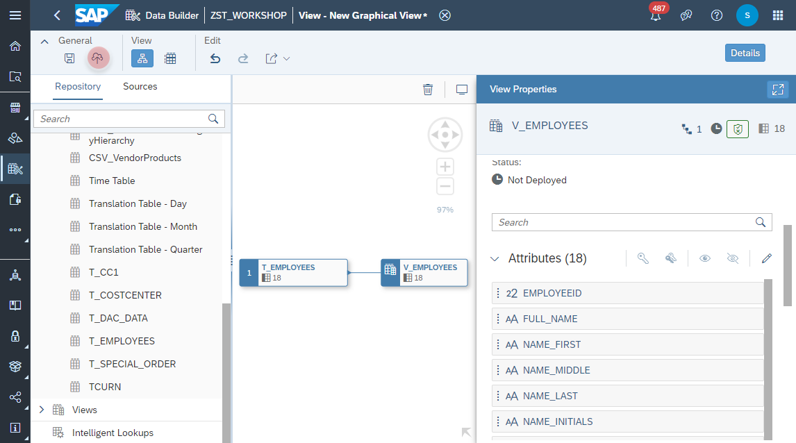

# Create <i>Employees</i> View

1. Navigate to the Repository Explorer
2. Click on <b><i>Create - Graphical View</i></b> Button to create a new view
      
3. Drag and drop the table <b><i>T_EMPLOYEES</i></b> into the canvas
    
4. Select the Output Node in the canvas and configure the following properties:
    - Business Name: <b>V_EMPLOYEES</b>
    - Technical Name: <b>V_EMPLOYEES</b>
    - Semantic Usage: <b>Dimension</b>
    - Expose for Consumption: <b>ON</b>
      

5. Click on the <b>Hierarchy</b> button 
    
6. Add a new <b>Parent Child Hieararchy</b> (aka Internal Hierarchy)
    
7. Adjust the following properties:
    - Business Name: <b>Employee Hierarchy</b>
    - Technical Name: <b>EMP_HIER</b>
    - Parent Column: <b>MANAGERID</b>
    - Child Column: <b>EMPLOYEEID</b>
    
8. Selct the _Output_ Node and click on _Edit_ button of the _Attributes_ section.
    
10. Set the  
    
12. Select the Output Node in the canvas and click on <b>Data Preview</b> from the context menu
      
11. Click on <b><i>deploy</i></b> button to deploy the view
    

