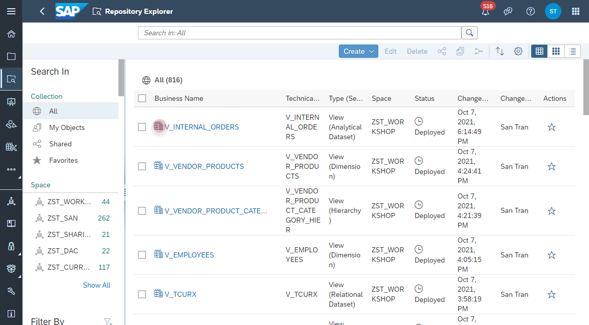
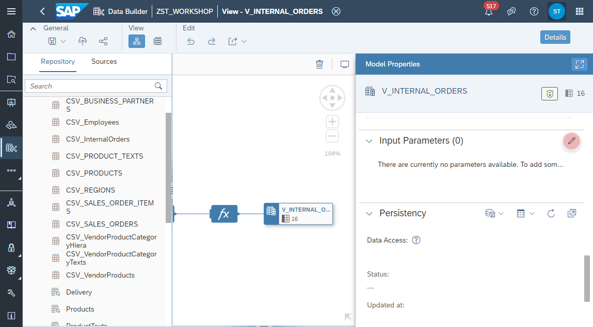
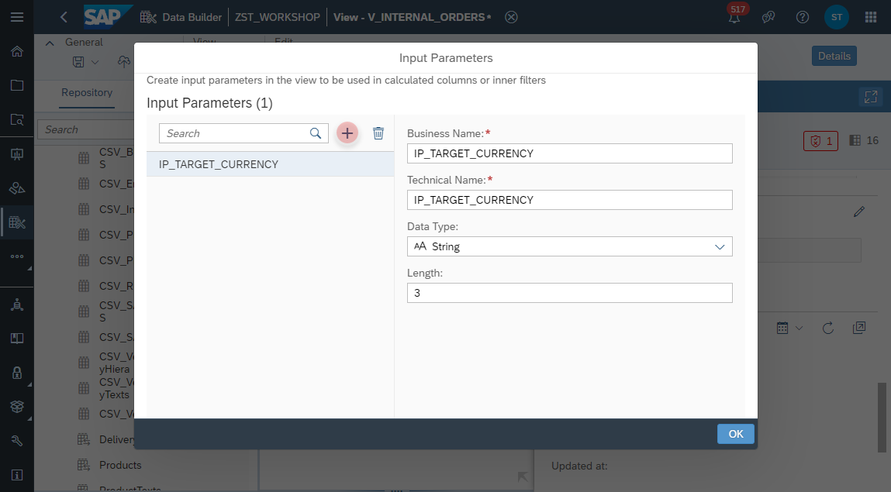
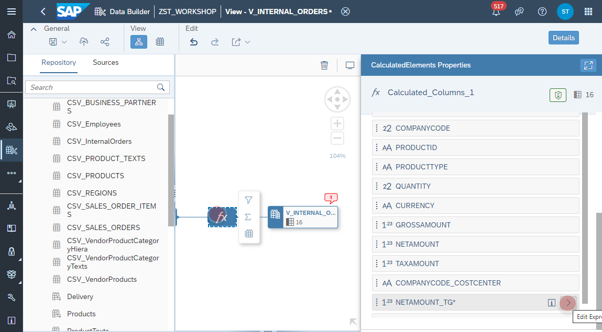
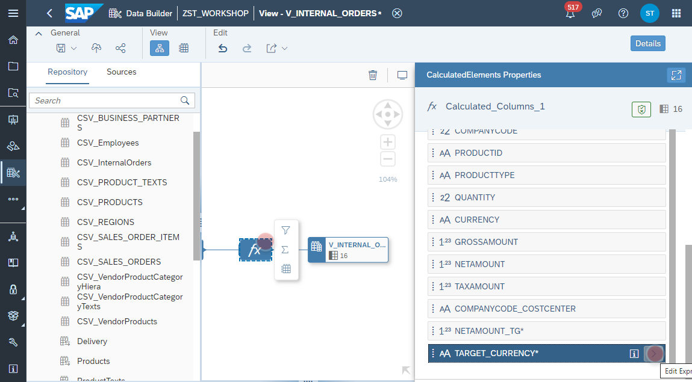
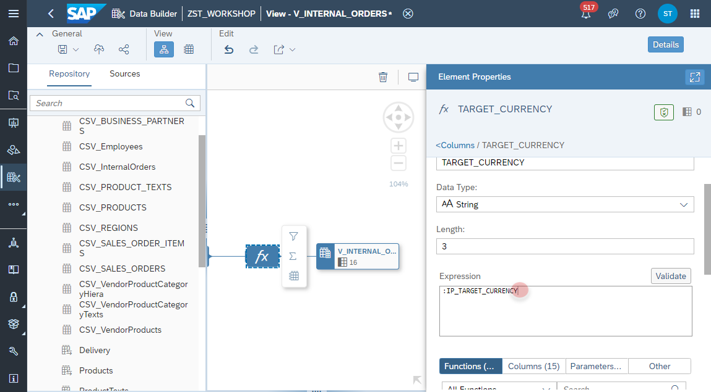
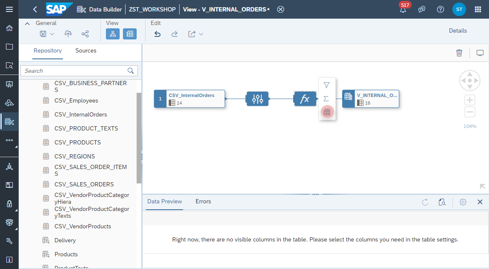
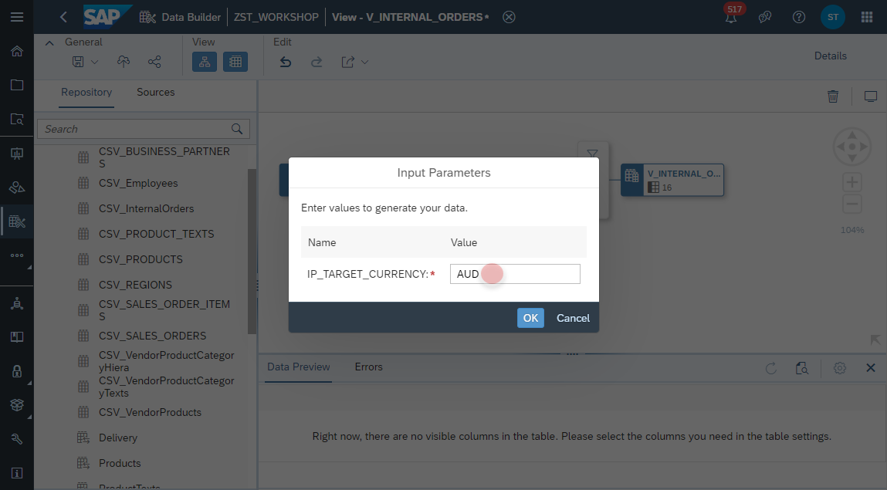
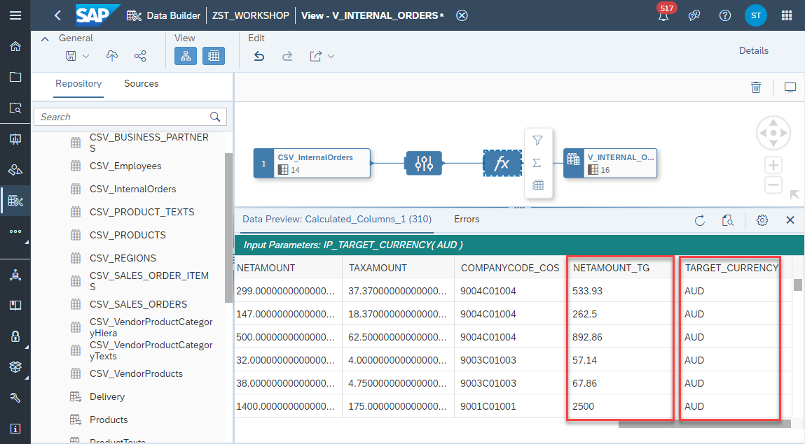

# Create Input Parameters

1. Navigate to the Repository Explorer
2. Search and open the view **V_INTERNAL_ORDERS** Button to create a new view
      
3. Select the _Output Node_ and click on the **Edit** button in the _Input Parameter_ section.
    
4. Add a new Input Parameter with the following properties:
    - Business Name: **IP_TARGET_CURRENCY**
    - Technical Name: **IP_TARGET_CURRENCY**
    - Data Type: **String**
    - Length: **3**
    
     

5. Select the _Calculation Node_ and edit the column **NETAMOUNT_TG**
    

6. In the _Calculation Expression_ replace in the _CONVERT_CURRENCY()_ function the 'EUR' with the input parameter **:IP_TARGET_CURRENCY**
    

7. Select again the _Calculation Node_ and edit the column **TARGET_CURRENCY**
    

8. In the _Calculation Expression_ replace in the constant value 'EUR' with the input parameter **:IP_TARGET_CURRENCY**
    

9. Select the _Calculation Node _ and click on the **Data Preview** button from the context menu
    

10. In the _Input Parameter_ prompt enter the currency **AUD** (Australian Dollar)
    

11. Click on **OK** button to confirm. Please check the values on the columns **NETAMOUNT_TG** and **TARGET_CURRENCY**:
    

