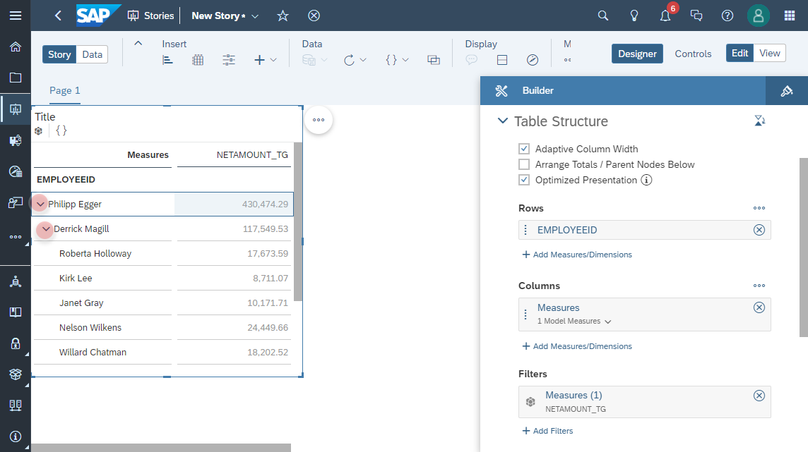
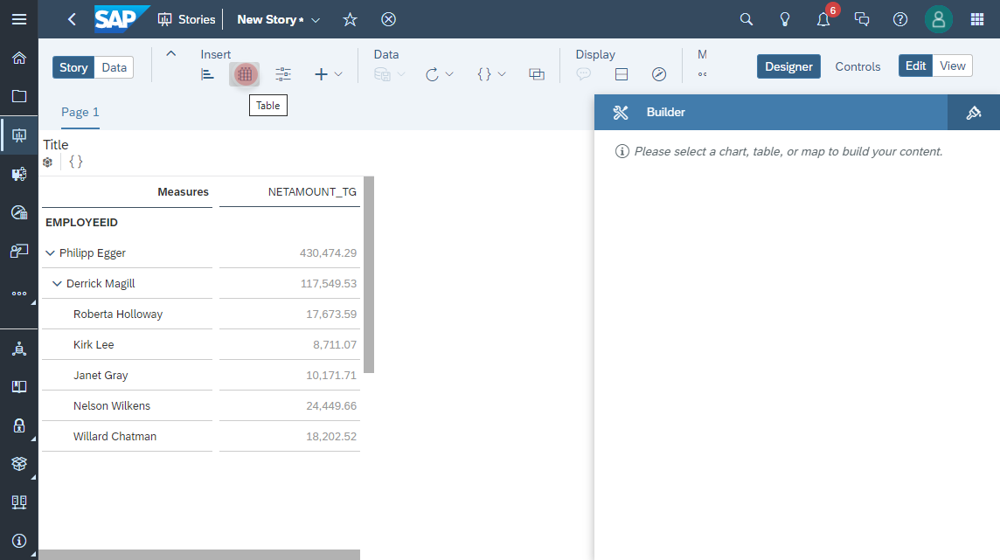
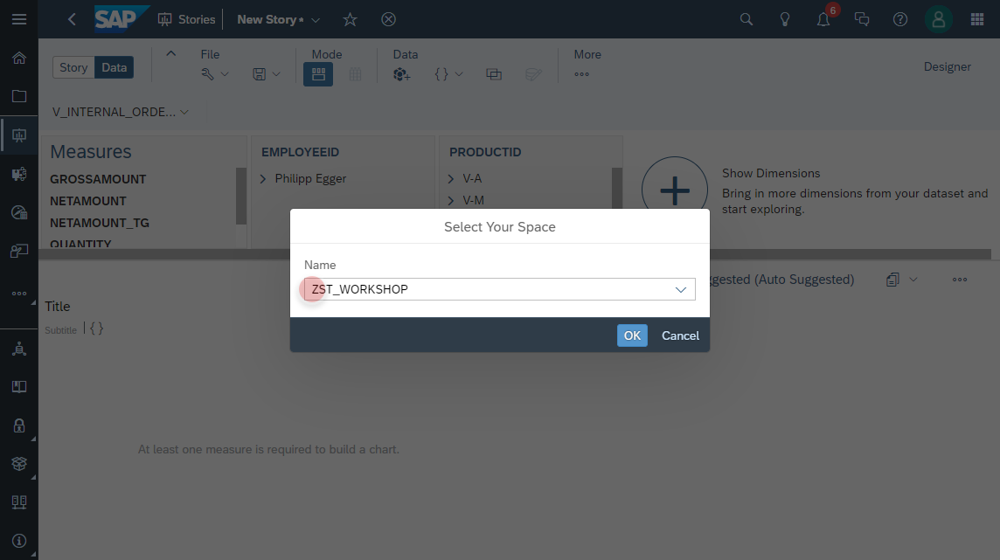
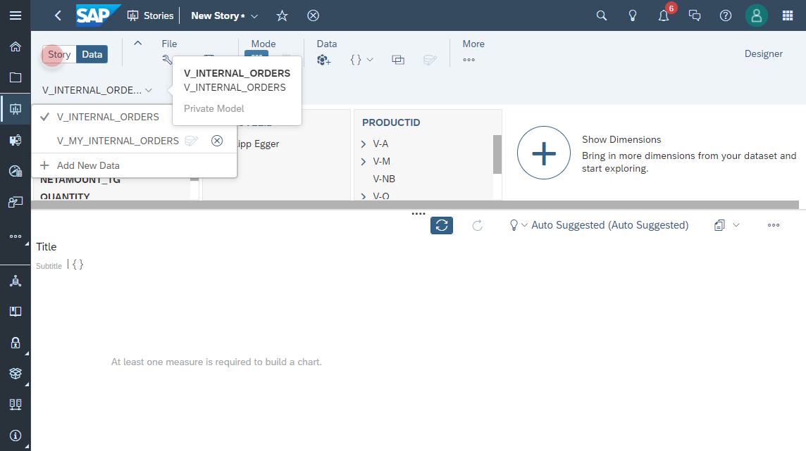
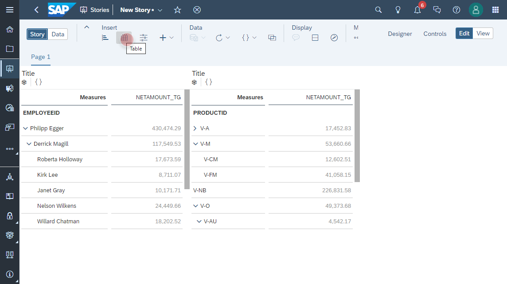
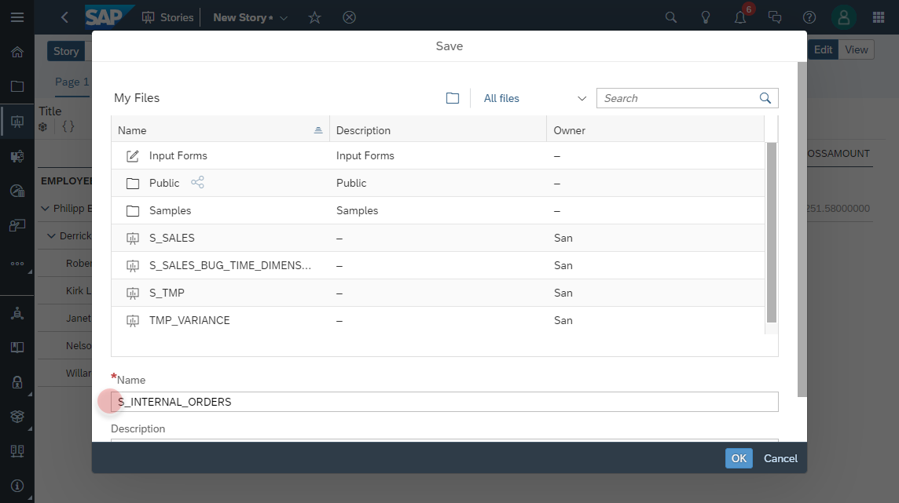

# Create Internal Orders Story in SAP Analytics Cloud

1. In SAP Analytics Cloud navigate to **Stories** to add a new **Canvas**
    
2. Click on **Add Data**
    
3. Click on **new Data Source**  
    
4. Select from the _Connect to Live Data_ section the connection to **SAP Data Warehouse Cloud**
    

5. Add a **new Table** to the canvas
    
  
6. Select **V_INTERNAL_ORDERS** as the data source
    
  
7. Since the model _V_INTERNAL_ORDERS_ contains an _Input Parameter_, a Prompt Dialog will show up. Please enter **EUR** as currency for the parameter **IP_TARGET_CURRENCY**.
    

8. **Filter** the measures from the **Columns** section 
    

9. Select the measure **NETAMOUNT_TG** 
    
    

10. Add the column **EMPLOYEEID** into the **Rows** section
    

11. **Expand the Employee Hierarchy** and check result as the following
    
  
12. Add a **new Table** into the canvas
    
  

13. **Filter** the measures from the **Columns** section 
    
  
14. Select the measure **NETAMOUNT_TG** 
    
   

15. Add the column **PRODUCTID** into the **Rows** section
    

16. **Expand the Vendor Product Category Hierarchy** and check result as the following
    

16. Click on **Data** from the toolbar
    

17. Click on **Add New Data**
    

17. Click on _Data from a data source_.
    

18. Select _SAP Data Warehouse Cloud_ as a source.
    

19. Select the configured connection.
    

20. Select your working space.
    
  
21. Select the model **V_MY_INTERNAL_ORDERS**
    
  
22. Return to the story by clicking on the _Story_ button from the toolbar.
    
  
23. Add a new _Table_.
    

24. Make sure that the new data source **V_MY_INTERNAL_ORDERS** is selected.
    

25. Add the column **COMPANYCODE** in the section _Rows_.
  In the table, you should be able to see records for the company code **9004** only.
    

26. Click _Save_ to save the story.
    

27. Enter the story name **S_INTERNAL_ORDERS**
    

28. The end result should look like the following:
    
