 # Create Internal Orders View

1. Navigate to the Repository Explorer
2. Click on <b><i>Create - Graphical View</i></b> Button to create a new view
      
3. Drag and drop the table **_CSV_InternalOrders_** into the canvas.
    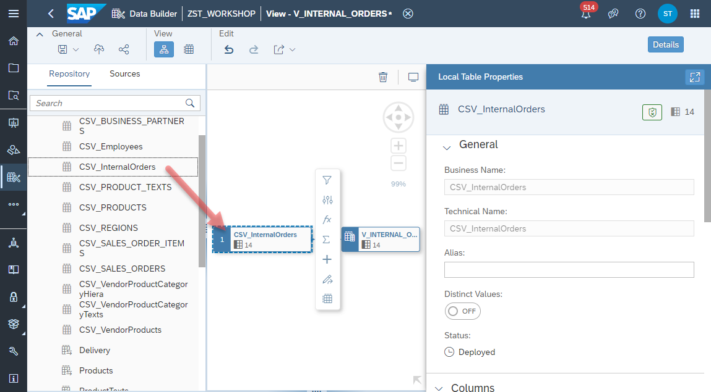

4. Select the Output Node in the canvas and configure the following properties:
  - Business Name: <b>V_INTERNAL_ORDERS</b>
  - Technical Name: <b>V_INTERNAL_ORDERS</b>
  - Semantic Usage: <b>Analytical Dataset</b>
  - Expose for Consumption: <b>ON</b>
    
5. Select the *Output Node* and change the following columns to **Measure**:
  - **GROSSAMOUNT**
  - **NETAMOUNT**
  - **TAXAMOUNT**
  - **QUANTITY**
    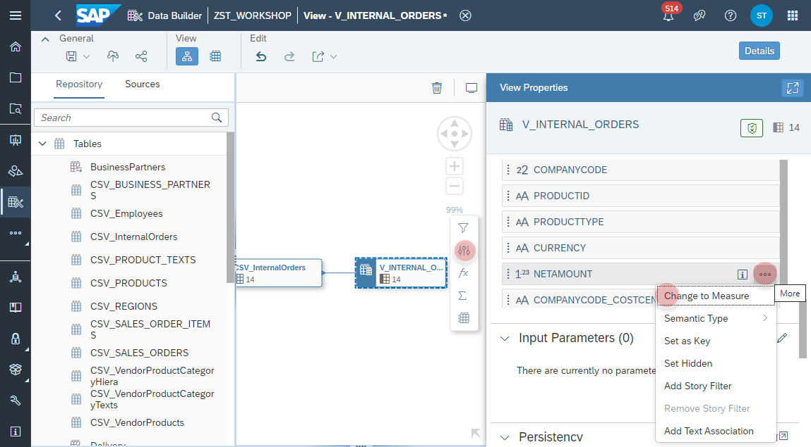

6. Select the **_CSV_InternalOrders_ Node** and add a new **Projection Node** from the context menu
    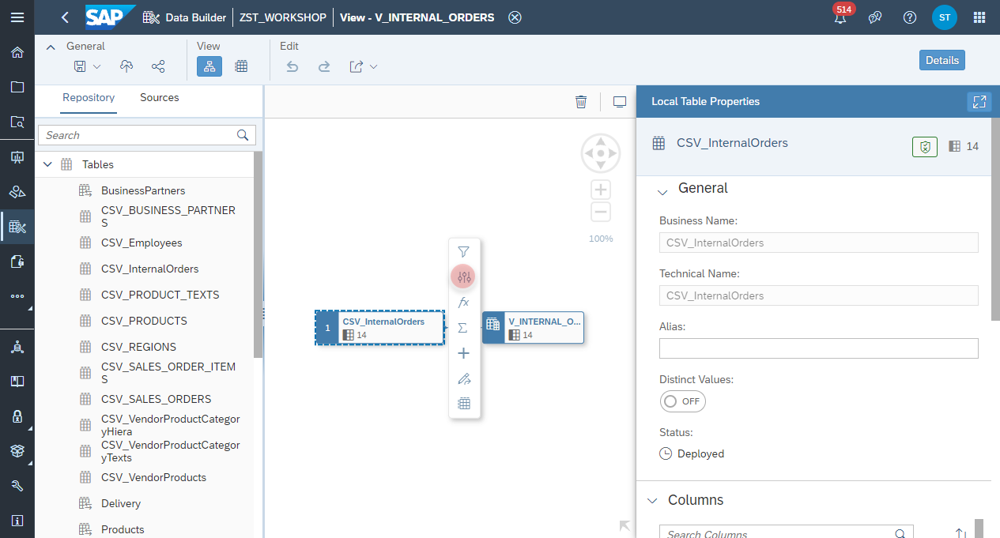

7. Select the _Projection Node_ and change the name of the column **CREATEDAT** 
    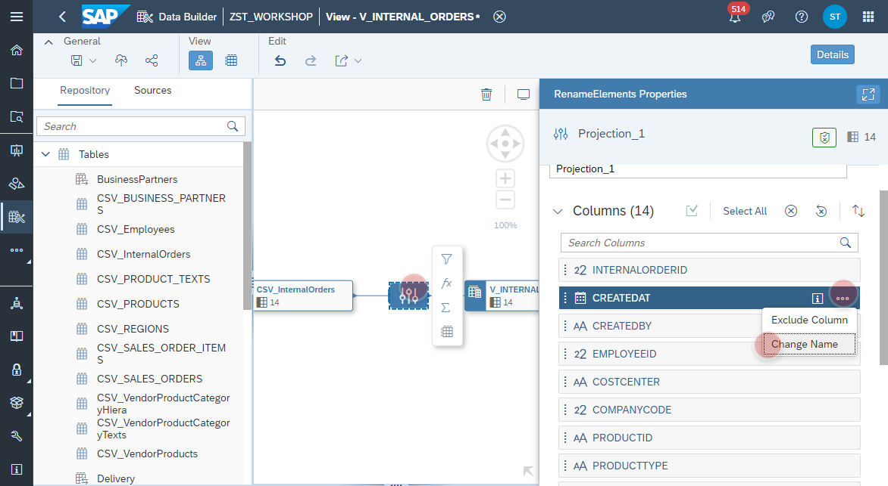
  
8. Set the new name to **CREATE_DATE**
    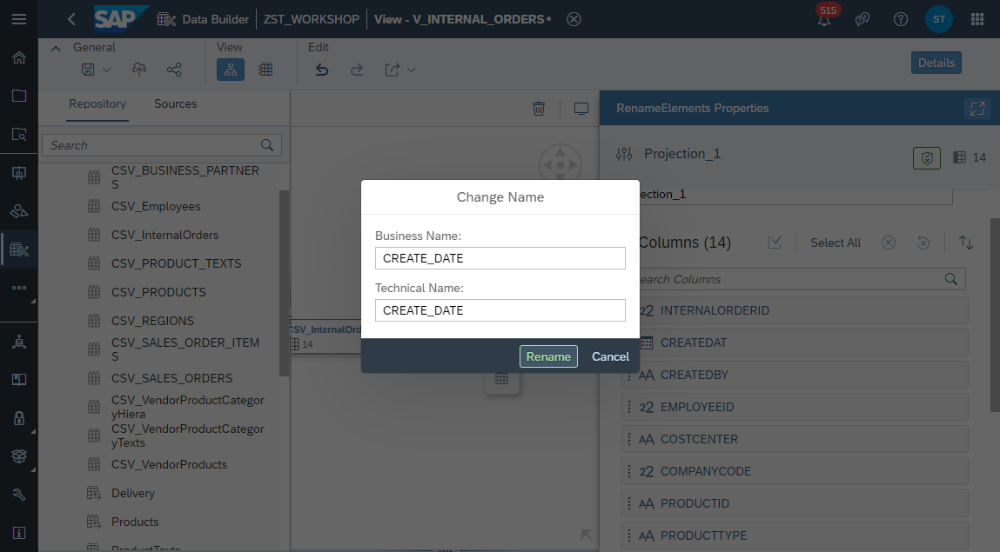
  
9. Select the _Output Node_ and add a new **Association**
   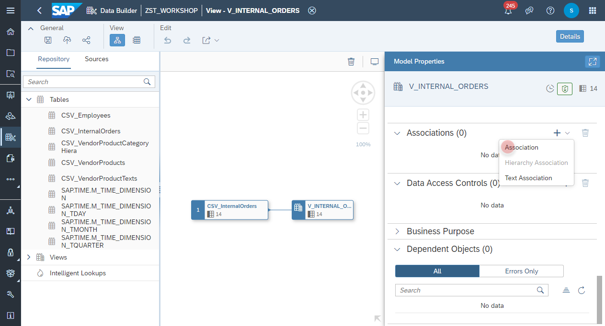

10. Search and select the view **V_VENDOR_PRODUCTS**
   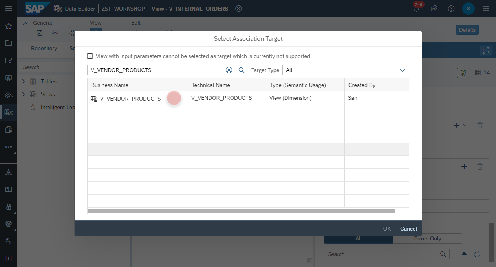

11. Map the column **V_VENDOR_PRODUCTS.PRODUCTID** with the column **V_INTERNAL_ORDERS.PRODUCTID**
   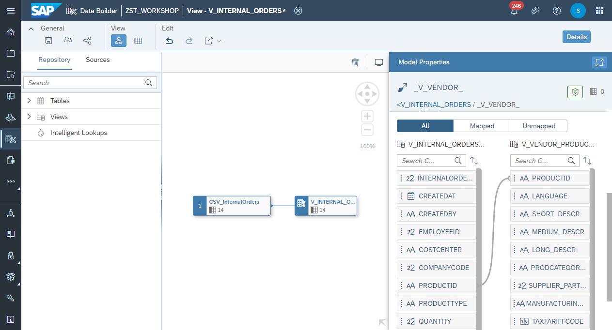

12. Select the _Output Node_ and add a new **Association**
   

13. Search and select the view **V_EMPLOYEES**
   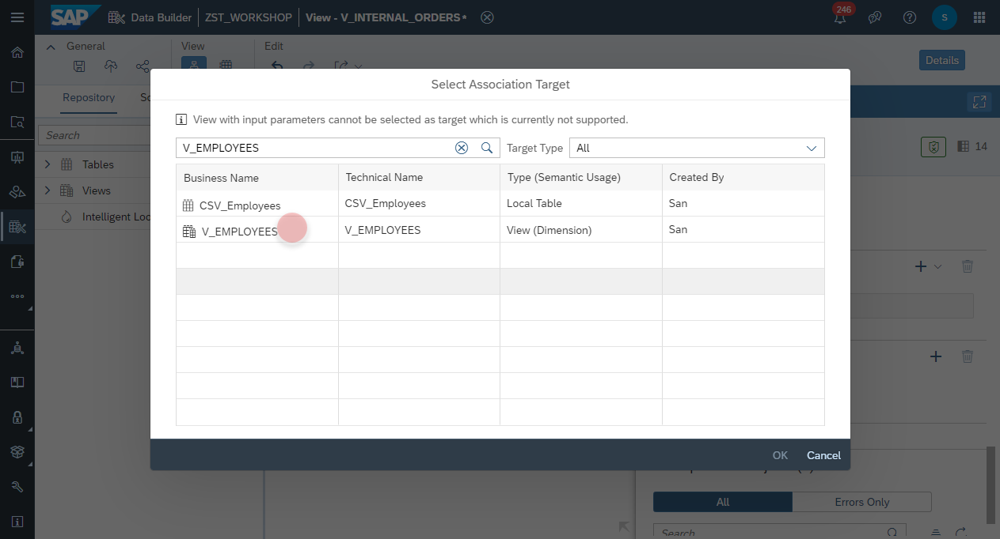

14. Map the column **V_EMPLOYEES.EMPLOYEEID** with the column **V_INTERNAL_ORDERS.EMPLOYEEID**
   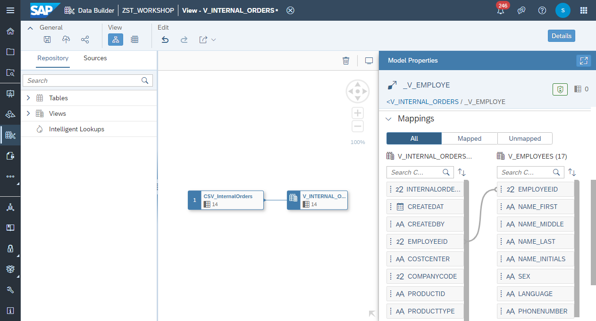

15. Select the _Output Node_ and add a new **Association**
   

16. Search and select the view **SAP.TIME.VIEW_DIMENSION_DAY (Time Dimension - Day)**
   

17. Map the column **V_INTERNAL_ORDERS.CREATE_DATE** with the column **SAP.TIME.VIEW_DIMENSION_DAY.DATE_SQL**
    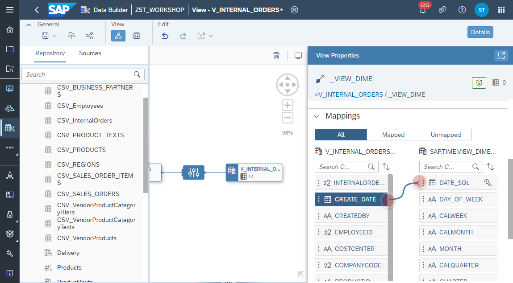

18. Click on the **Deploy** button to deploy the view.
    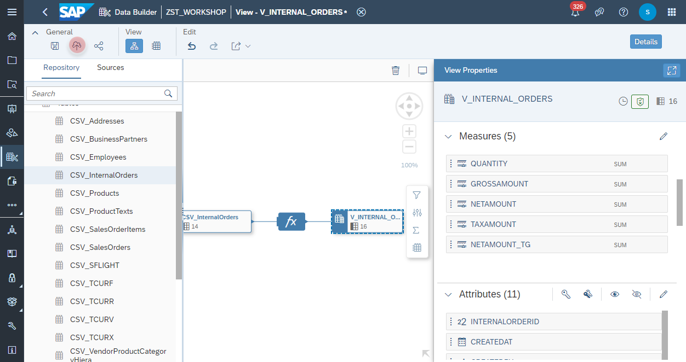
    

  

  
