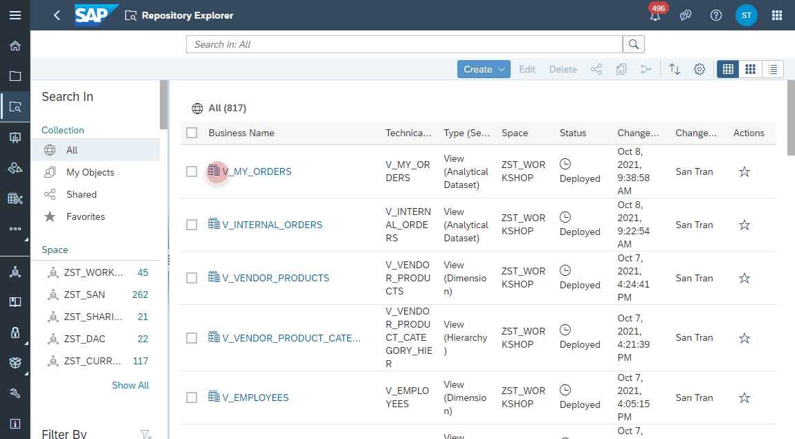
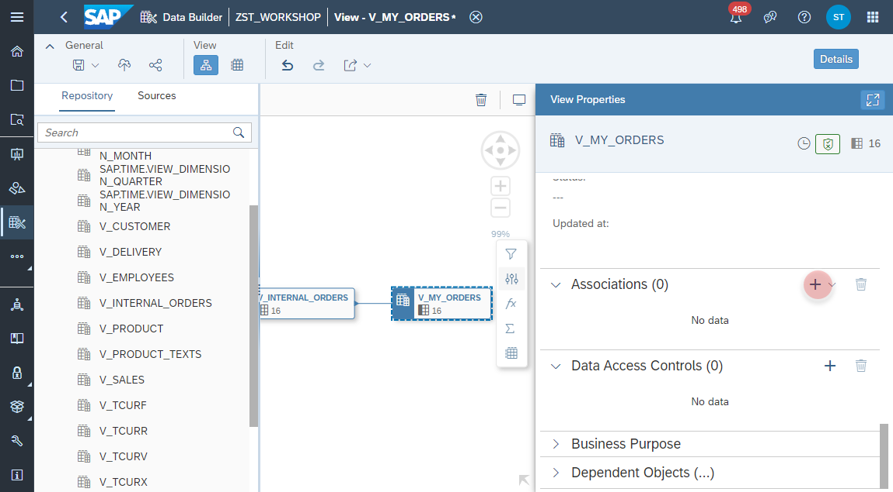
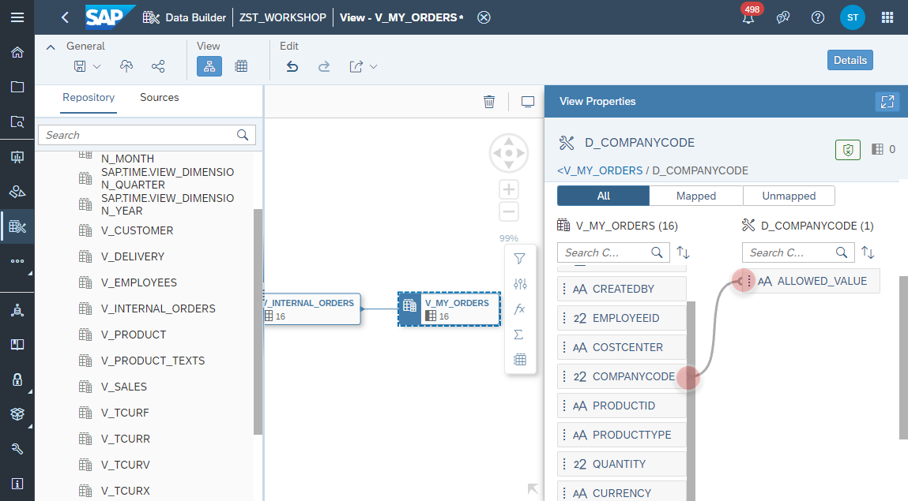
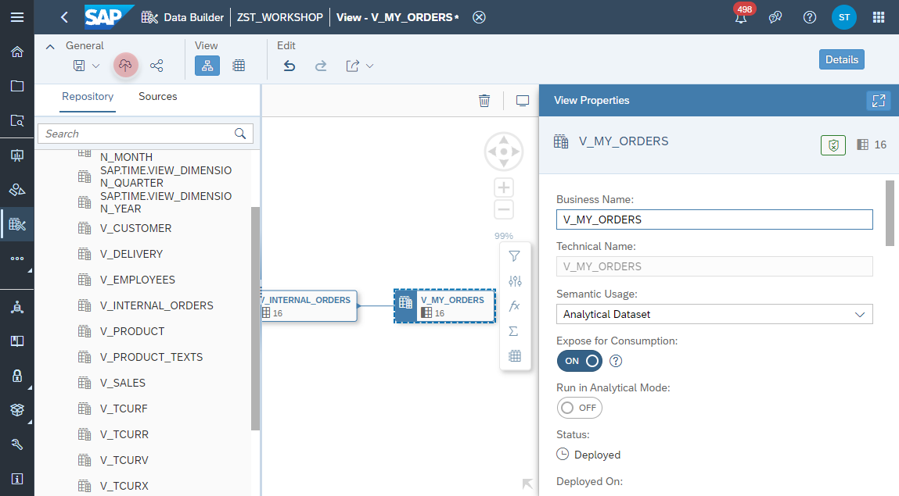
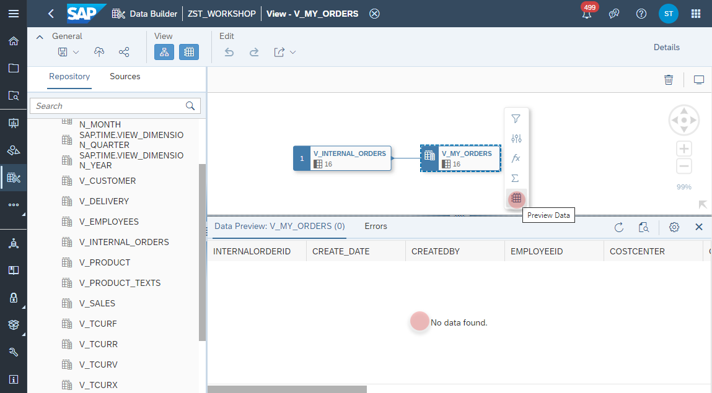

# Use Data Access Control in _My Orders_ View

1. Navigate to the Repository Explorer
2. Search and open the view **_V_MY_ORDERS_**, which you have created previously.
      

3. Navigate to the _Data Access Control_ section of the Output Node and add a new Data Access Control.
    
  
4. Select the Data Access Control **D_COMPANYCODE**.
    
  
5. Map the **_V_MY_ORDERS_.COMPANYCODE** column to the Data Access Control **D_COMPANYCODE.ALLOWED_VALUE** column.
   >🎓Note: With the mapping, the data access of the view _V_MY_ORDERS_ is now secured by filtering the data on _Company Code_ with user's allowed values. If user does not have valid entries in the _T_DAC_DATA_ table, he will not be able to see any value.
  
     

6. Click on the **Deploy** button to deploy the view.
    

7. Select on the _Output_ Node the Data Preview from the context menu. As a result you should not see any data, since your user does not have any valid access maintained in the table **T_DAC_DATA**. This will be part of the next exercise :)

    
