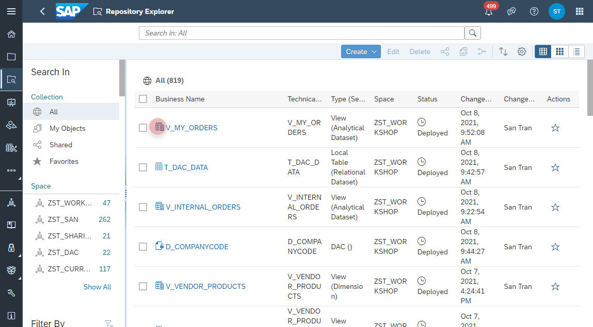
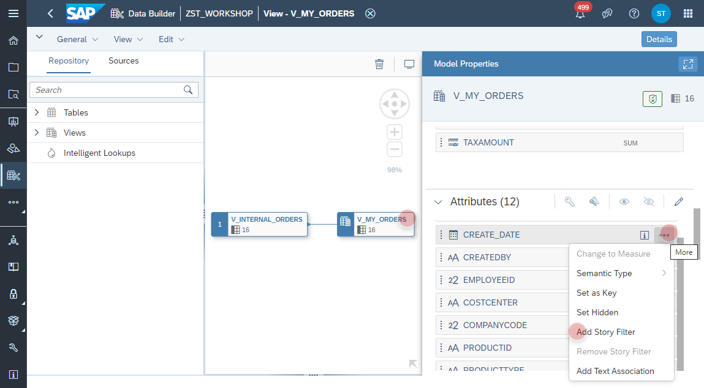
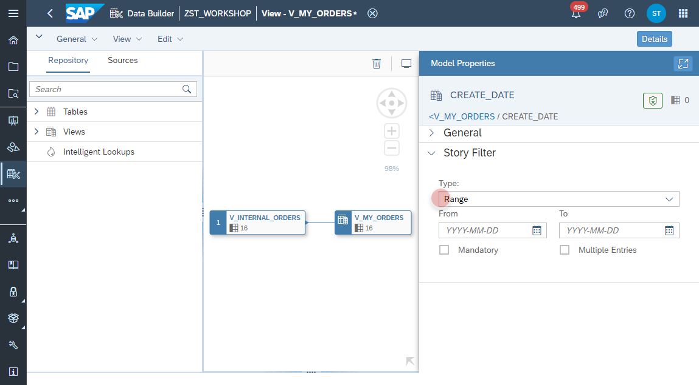
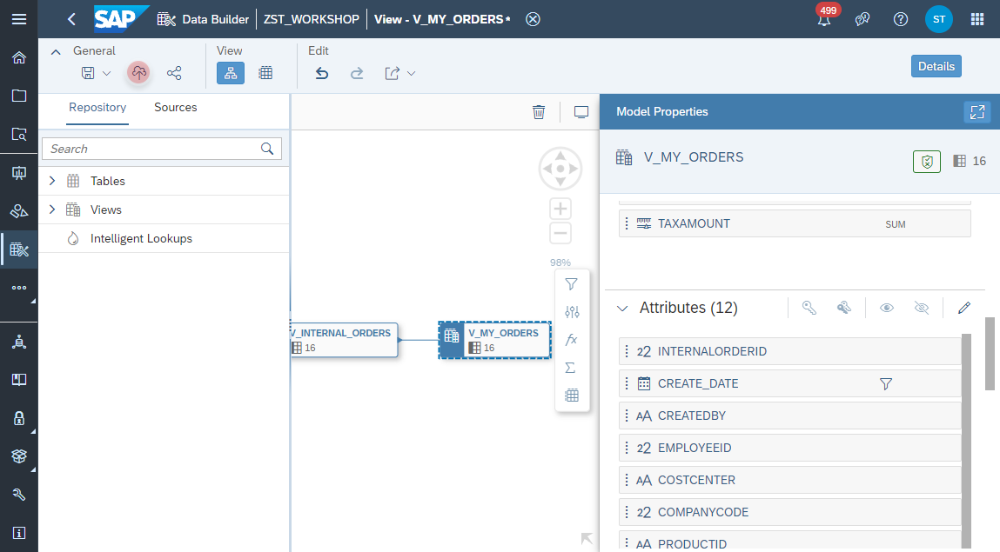

# SAP Analytics Cloud Story Filter

1. Navigate to the Repository Explorer
2. Search and open the view _**V_MY_ORDERS**_ 
     
3. Select the _Output Node_ and the select the column **CREATE_DATE** to add a new **Story Filter** from the context menu
     
4. Set the filter type to **Range**
     
5. Click on the **Deploy** button.  
     
   
