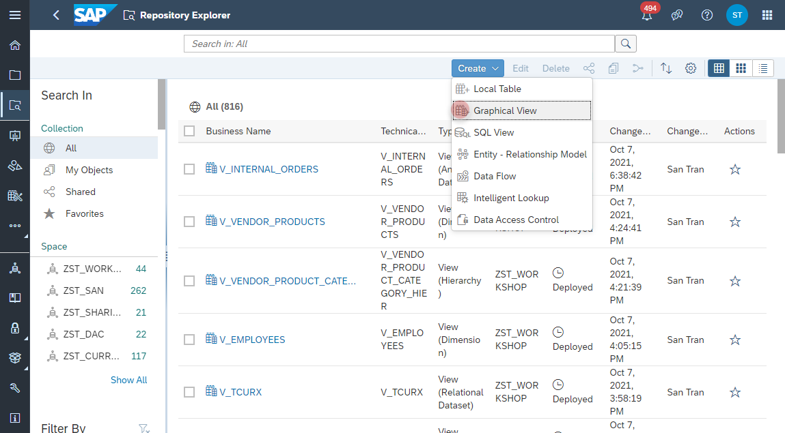
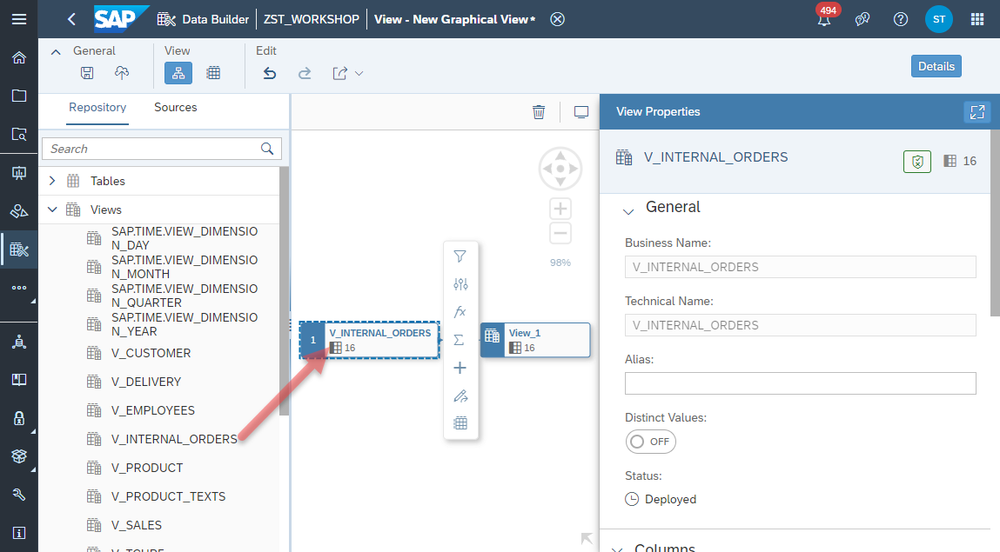
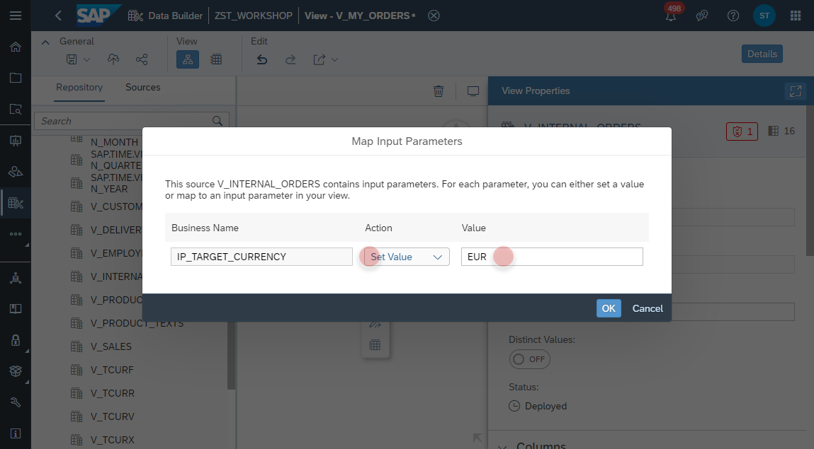
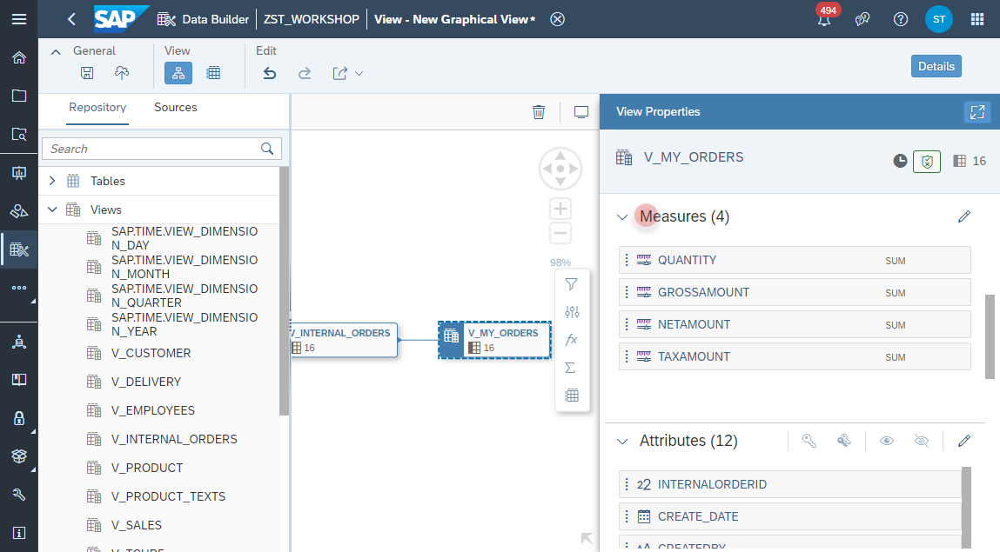
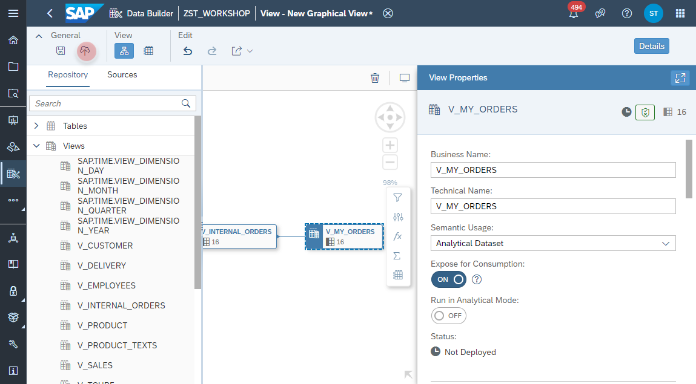

 # Create My Orders View

1. Navigate to the Repository Explorer
2. Click on <b><i>Create - Graphical View</i></b> Button to create a new view
      
3. Drag and drop the previously created view **_V_INTERNAL_ORDERS_** into the canvas.
   >:mortar_board: **Note**: the properties and semantics from the previous view will be inherited to the new view, such as Measure classification, Attributes Semantics, etc. In the future also Input Parameters, Associations, Text and Hierarchy definitions will be reusable. 
  
     

4. In the _Map Input Parameter_ dialog, set the _Action_ to **Set Value** and set _Value_ to **EUR** 
    

5. Select the Output Node in the canvas and configure the following properties:
  - Business Name: <b>V_MY_ORDERS</b>
  - Technical Name: <b>V_MY_ORDERS</b>
  - Semantic Usage: <b>Analytical Dataset</b>
  - Expose for Consumption: <b>ON</b>
  
      
      
  
  
6. Click on the **Deploy** button to deploy the view.
    

  

  
