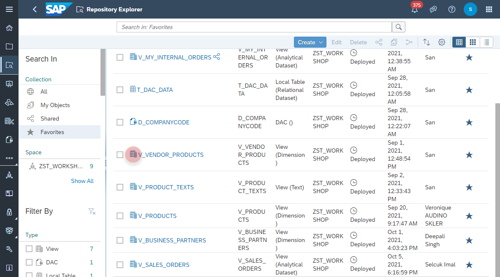
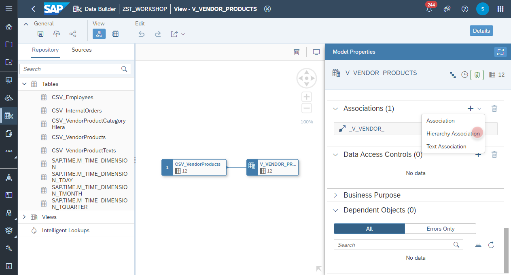
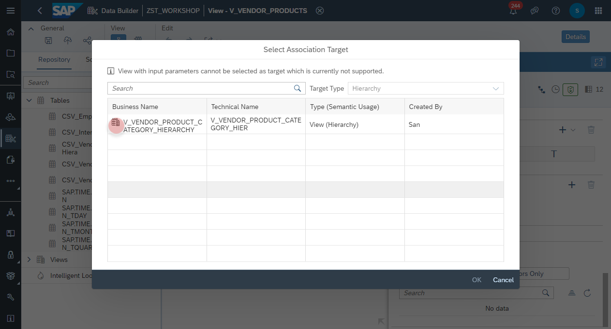
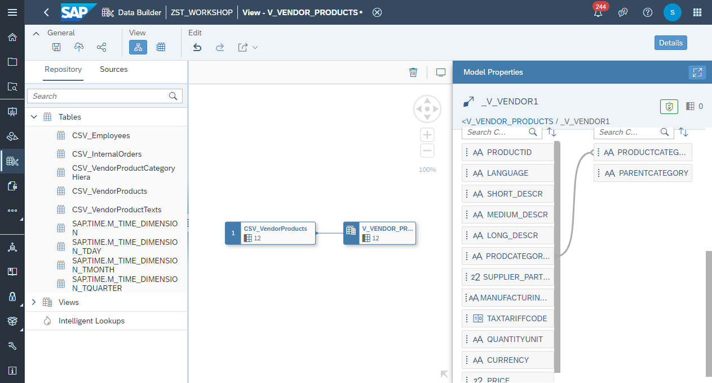
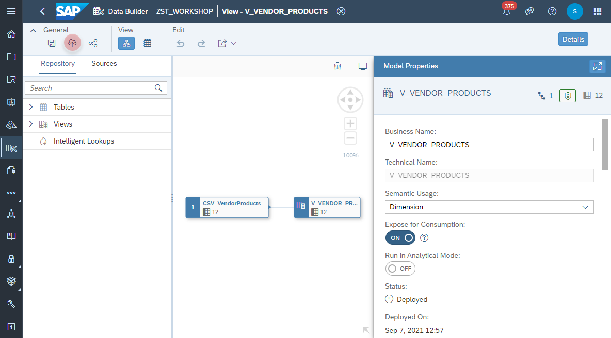

# Create <i>Hierarchy Association</i>

1. Navigate to the Repository Explorer
2. Search and edit the view _**V_VENDOR_PRODUCTS**_
      
 8.  Navigate to the <i>Associations</i> section and add a new <b>hieararchy association</b>
    
 9. Find and select <b>V_VENDOR_PRODUCT_CATEGORY_HIERARCHY</b> View as the association target.
    
 10. Map the columns <b>V_VENDOR_PRODUCTS.PRODUCTCATEGORYID</b> and <b>V_VENDOR_PRODUCT_CATEGORY_HIERARCHY.PRODUCTCATEGORY</b>
    
 12. Click on <b><i>deploy</i></b> button to deploy the view
    
