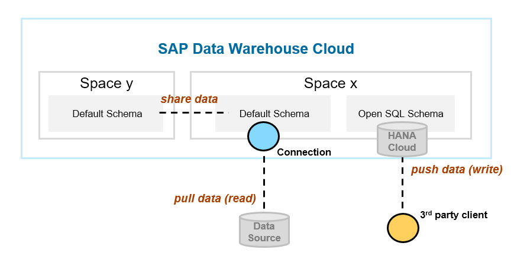

# Exercise 4 - Sales Orders Extension

In this exercise, you're going to bring more data into the system and consolidate them with the Sales Orders.
The classic way to ingest data is to **setup a connection with the data source** and afterwards to pull the data.
In addition to that SAP Data Warehouse Cloud offers some more options, which covers different scenarios and needs, such as: 

### Pushing data to Open SQL Schema
The _Pushing Data_ approach is similar to _Pulling data_ approach. The main difference is the trigger point, who initiates the data load process. 
While in the Pulling Data scenario the initiator is SAP Data Wareshouse Cloud itself by connecting to the source and **reading the data** from it, whereas in the Pushing Data scenario, the initiator is an external client which **writes the data** into a dedicated persistence of SAP Data Warehouse Cloud: the _Open SQL Schema_.  
The Open SQL Schema will grant a database user with access rights to read and write into the undelying persistence of SAP Data Warehouse Cloud, which is the SAP HANA Cloud. 
By using the database user credential, you can access the schema either with the SAP HANA Database Explorer (part of the SAP Data Warehouse Cloud delivery) or with any other 3rd party client of your choice. With that you can execute standard SQL DDL and DML statements.

### Sharing data from Spaces
In general, in SAP Data Warehouse Cloud you can use _Spaces_ to isolate resources such as CPU, disc spaces, users and data by grouping them logically to the business needs.
However, Spaces can also be used to share dedicated data and models to other spaces and make them available there. The shared data and models can be used, as if they were in the same space you are working. Hence, it is possible to reuse existing data and models from other spaces without the need of shifting and synchronizing data forth and back. A typical scenario is a central space for master data. The benefit is a much lower development effort and TCO. 

### Downloading data from Data Market Place
The latest feature in SAP Data Warehouse Cloud is the Data Market Place, where partners and customers can offer data and models for download / purchase. For instance, that could be tailor made content for a specific industry or a market dataset which you require for your business scenario. The data market place allows you and others to exchange and monetize datasets, which can be easily integrated with your models in SAP Data Warehouse Cloud.

In the following exercise we will cover all of these options and enrich the existing Sales Order model:

[<h2>Exercise 4 - Sales Orders Extension</h2>](exercises/ex4/)
- **Exercise 4.1 - Get data from Open SQL Schema**
   - [Exercise 4.1.1 - Create Database Access User and Open SQL Schema](/exercises/ex4/open-sql-schema)
      - Database Access User
      - Open SQL Schema 
   - [Exercise 4.1.2 - Create a local Sales Order Table](/exercises/ex4/special-sales-orders-table)   
      - Database Explorer  
   - [Exercise 4.1.3 - Adjust the Sales Order View](/exercises/ex4/sales-orders-union)
      - Union Node   
   - [Exercise 4.1.4 - Use 3rd party database client](/exercises/ex4/3rd-party-db-client) :construction::construction::construction:
- **Exercise 4.2 - Get data from Data Market Place** 
   - [Exercise 4.2.1 - Download Sample Data from the Data Market Place](/exercises/ex4/data-market-place-sample-data-download)
      - Data Market Place
   - [Exercise 4.2.2 - Create Sample Data View](/exercises/ex4/data-market-place-sample-data-view)
   - [Exercise 4.2.3 - Update Sales Orders View with Sample data](/exercises/ex4/data-market-place-update-sales-view)
- **Exercise 4.3 - Get data from Shared Spaces** 
   - [Exercise 4.3.1 - Create Master Data Space](/exercises/ex4/master-data-space)
   - [Exercise 4.3.2 - Upload Region CSV File](/exercises/ex4/region-data-upload)
   - [Exercise 4.3.3 - Create Sales Organization View](/exercises/ex4/sales-organization-view)
   - [Exercise 4.3.4 - Share Sales Organization View](/exercises/ex4/sales-organization-view-share)
      - Cross Space Sharing 
   - [Exercise 4.3.5 - Adjust Sales Order View](/exercises/ex4/sales-orders-sales-organization)
