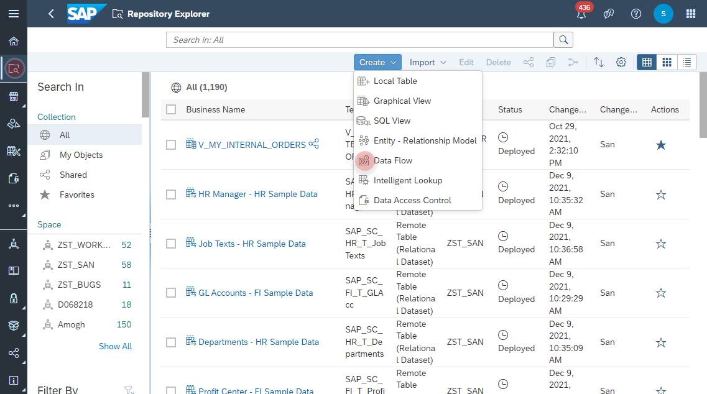
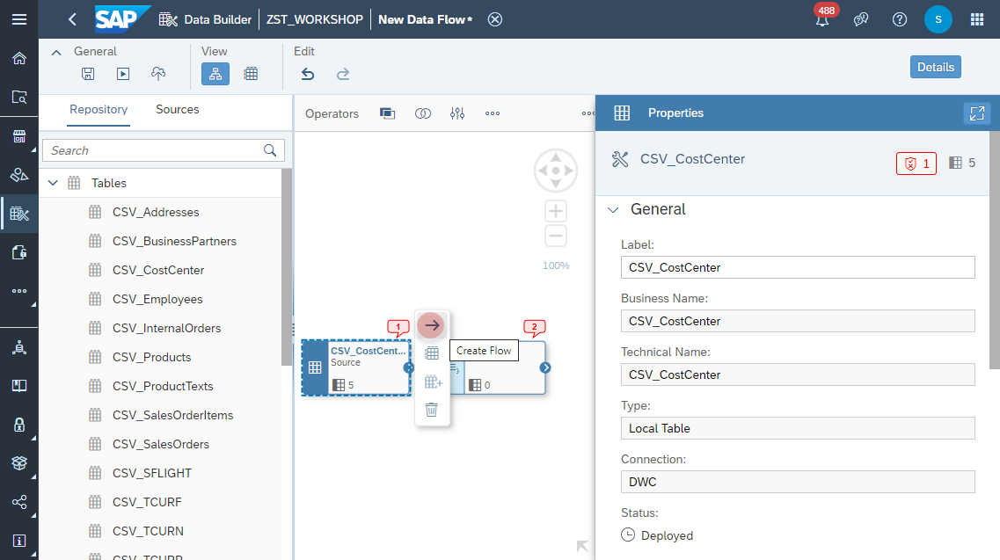

# Create <i>Cost Center </i> Data Flow

1. Navigate to the Repository Explorer
2. Click on **Create - Graphical View** button to create a new view
    
3. Click on **Details** button and configure the following properties:
  - Business Name: **V_SALES_ORDERS**
  - Technical Name: **V_SALES_ORDERS**
  - Semantic Usage: **Analytical Dataset**
  - Expose for Consumption: **ON**

  
  
  
  
  
  
  
  
  
  
  
  
  
  
  
  
  
  
  

