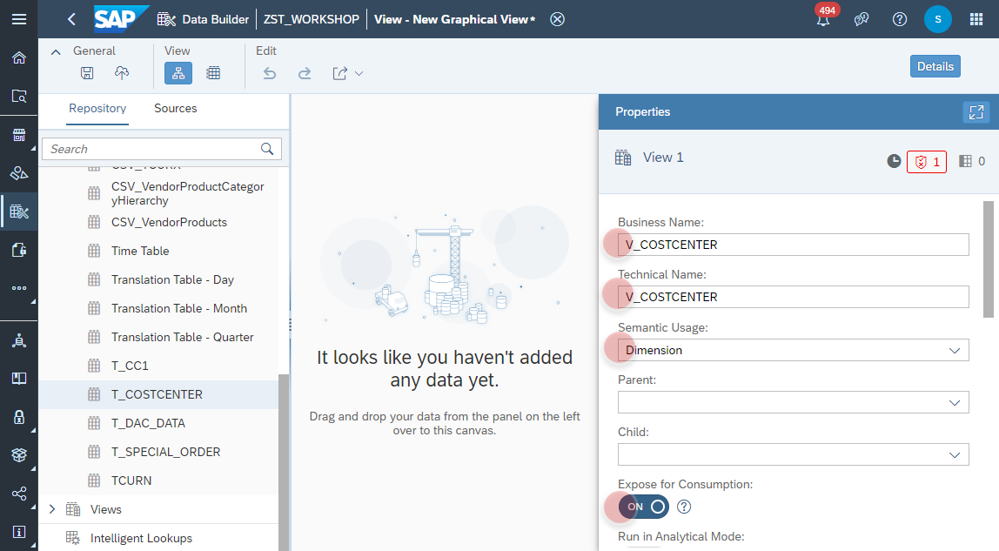

# Create <i>Cost Center</i> View

1. Navigate to the Repository Explorer
2. Click on <b><i>Create - Graphical View</i></b> Button to create a new view
     
  

3. Select the Output Node in the canvas and configure the following properties:
    - Business Name: <b>V_COSTCENTER</b>
    - Technical Name: <b>V_COSTCENTER</b>
    - Semantic Usage: <b>Dimension</b>
    - Expose for Consumption: <b>ON</b>
      
    
4. Drag and drop the table <b><i>T_COSTCENTER</i></b> into the canvas
     

5. Click on <b><i>deploy</i></b> button to deploy the view
    
