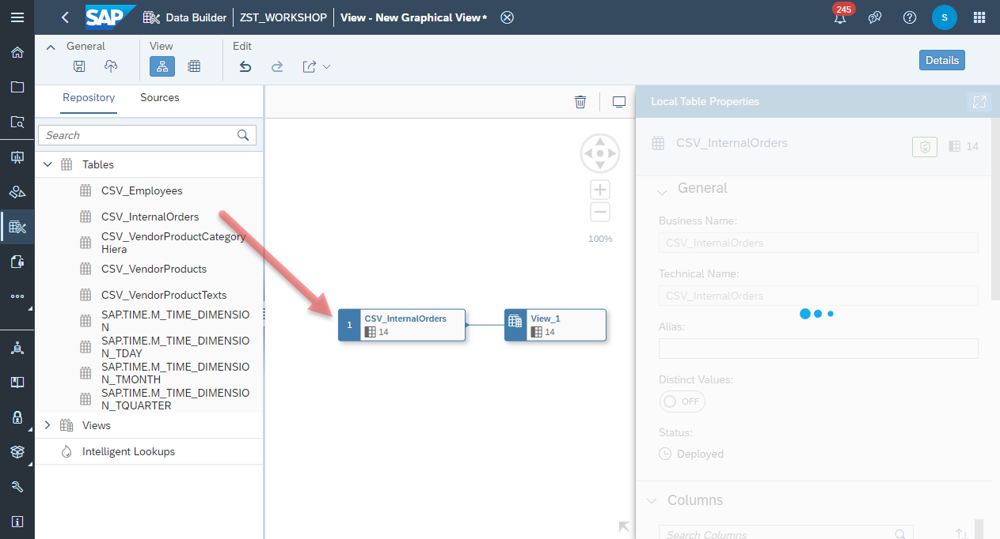
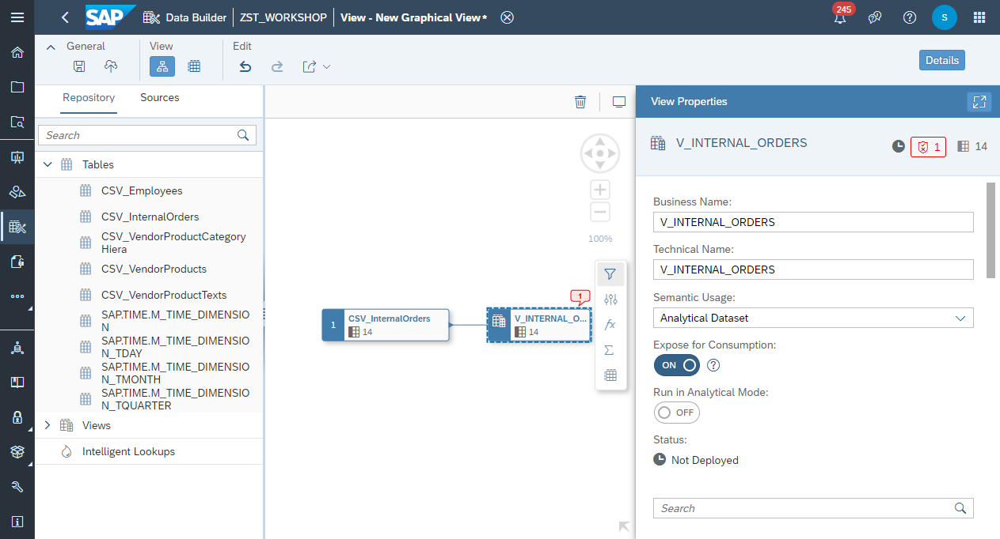
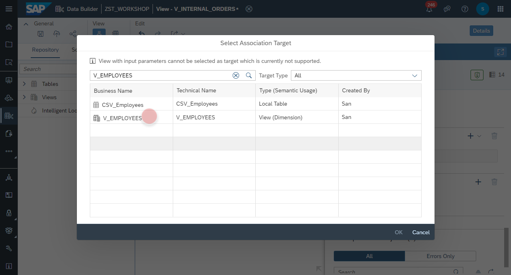
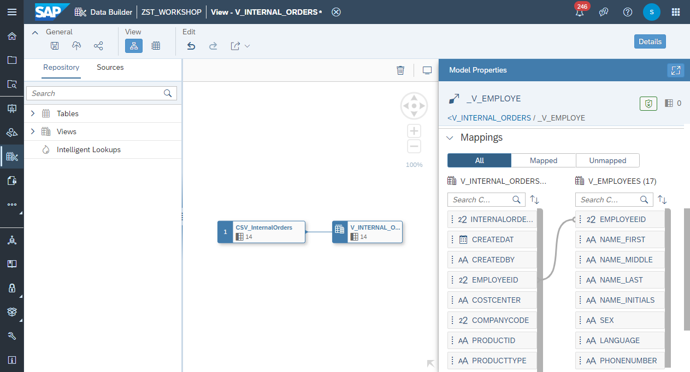
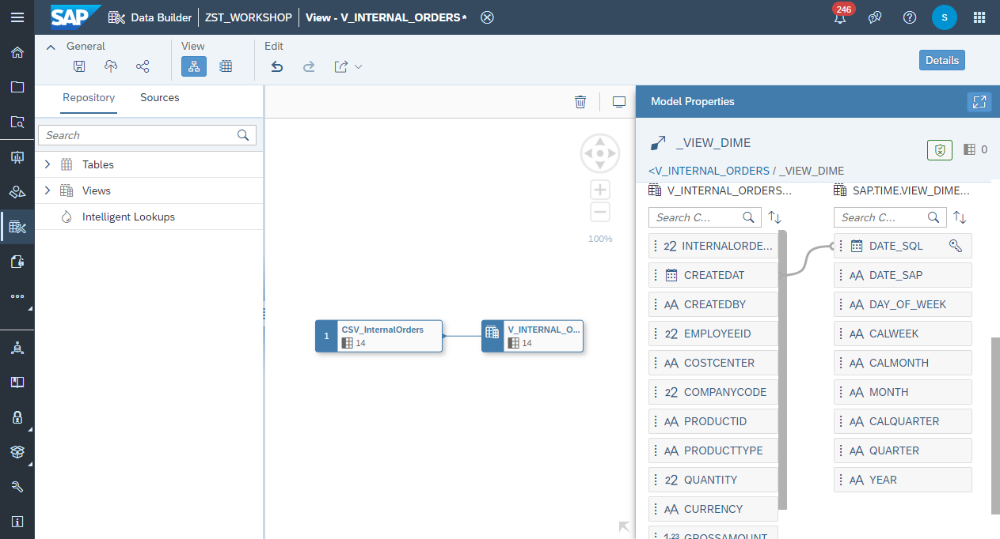
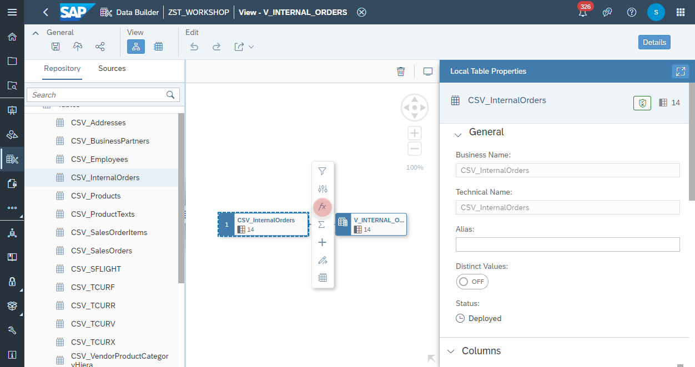
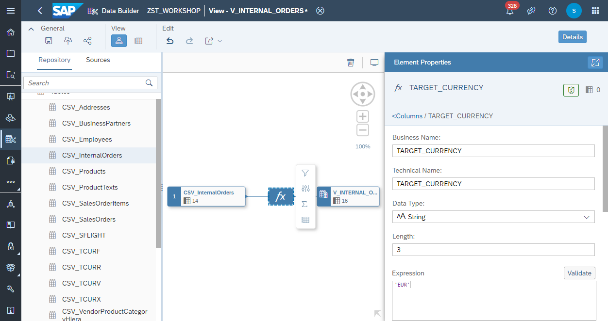

# Create Internal Orders View

1. Navigate to the Repository Explorer
2. Click on <b><i>Create - Graphical View</i></b> Button to create a new view
  <br><br><br><br>
3. Drag and drop the table <b><i>CSV_VendorProductCategoryHierarchy</i></b> into the canvas
  <br><br>
4. Select the Output Node in the canvas and configure the following properties:
    - Business Name: <b>V_INTERNAL_ORDERS</b>
    - Technical Name: <b>V_INTERNAL_ORDERS</b>
    - Semantic Usage: <b>Analytical Dataset</b>
    - Expose for Consumption: <b>ON</b>
    <br><br>

### Create Associations
5. Select the <i>Output</i> node in the canvas and add a new association from the <i>Associations</i> section: 
<br><br>
6. Find a select the view <b>V_VENDOR_PRODUCTS</b>
<br><br>

7. Map the column <b>V_INTERNAL_ORDERS.PRODUCTID</b> with the column <b>V_VENDOR_PRODUCTS.PRODUCTID</b>
<br><br>

8. Select the <i>Output</i> node in the canvas and add a new association from the <i>Associations</i> section: 
<br><br>

9. Find a select the view <b>V_EMPLOYEES</b>
<br><br>

10. Map the column <b>V_INTERNAL_ORDERS.EMPLOYEEID</b> with the column <b>V_EMPLOYEES.EMPLOYEEID</b>
<br><br>

11. Select the <i>Output</i> node in the canvas and add a new association from the <i>Associations</i> section: 
<br><br>

12. Find a select the view <b>SAP.TIME.VIEW_DIMENSION_DAY (Time Dimension-Day)</b>
<br><br>

13. Map the column <b>V_INTERNAL_ORDERS.CREATEDAT</b> with the column <b>SAP.TIME.VIEW_DIMENSION_DAY.DATE_SQL</b>
<br><br>

### Create Calculated Measures - Currency Conversion
14. Select the source node <b>CSV_InternalOrders</b> and add a new Calculation Node from the context menu.
<br><br>

15. Select the Calculation Node and add a new <b>Calculated Column</b>.
<br><br>

16. Configure the Calculated Column as the following:
    - Business Name: <b>TARGET_CURRENCY</b>
    - Technical Name: <b>TARGET_CURRENCY</b>
    - Data Type: <b>Double</b>
    - Length: <b>3</b>
    - Expression: <b>'EUR'</b>
    <br><br>

17. Select the Calculation Node and add another <b>Calculated Column</b>.
<br><br>

18. Configure the Calculated Column as the following:
    - Business Name: <b>NETAMOUNT_TG</b>
    - Technical Name: <b>NETAMOUNT_TG</b>
    - Data Type: <b>Double</b>
    - Length: <b>3</b>
    - Expression: 
      ```javascript
      CONVERT_CURRENCY(
        "AMOUNT" => "NETAMOUNT", 
        "SOURCE_UNIT" => "CURRENCY", 
        "TARGET_UNIT" => 'EUR', 
        "CONVERSION_TYPE" => 'M', 
        "REFERENCE_DATE" => CURRENT_DATE, 
        "CLIENT" => '002', "SCHEMA" => 'ZST_WORKSHOP', 
        "ERROR_HANDLING" => 'set_to_null', 
        "STEPS" => 'shift,convert,round', 
        "PRECISIONS_TABLE" => 'V_TCURX', 
        "CONFIGURATION_TABLE" => 'V_TCURV', 
        "PREFACTORS_TABLE" => 'V_TCURF', 
        "RATES_TABLE" => 'V_TCURR')
      ```
        >🎓 **CONVERT_CURRENCY() Function**: More information about the SAP HANA Function and the configuration of the parameters can be found under the [SAP Help site](https://help.sap.com/viewer/7c78579ce9b14a669c1f3295b0d8ca16/Cloud/en-US/d22d746ed2951014bb7fb0114ffdaf96.html). 


      <br>
      
    
19. Select the Calculation Node and click on <b>Data Preview</b> from the context menu.
    - Validate the values in <b>NETAMOUNT_TG</b> and <b>TARGET_CURRENCY</b>
    - Compare the values between <b>NETAMOUNT</b> and <b>NETAMOUNT_TG</b>
      <br><br>

### Set Measures
19. Select the <i>Output Node</i> and change the following columns into measures:<b>
  - NETAMOUNT
  - NETAMOUNT_TG
  - GROSSAMOUNT
  - TAXAMOUNT
  - QUANTITY</b>
  <br><br>
  <br>

### Deploy
9. Click on <b><i>deploy</i></b> button to deploy the view
<br><br>
<br>
