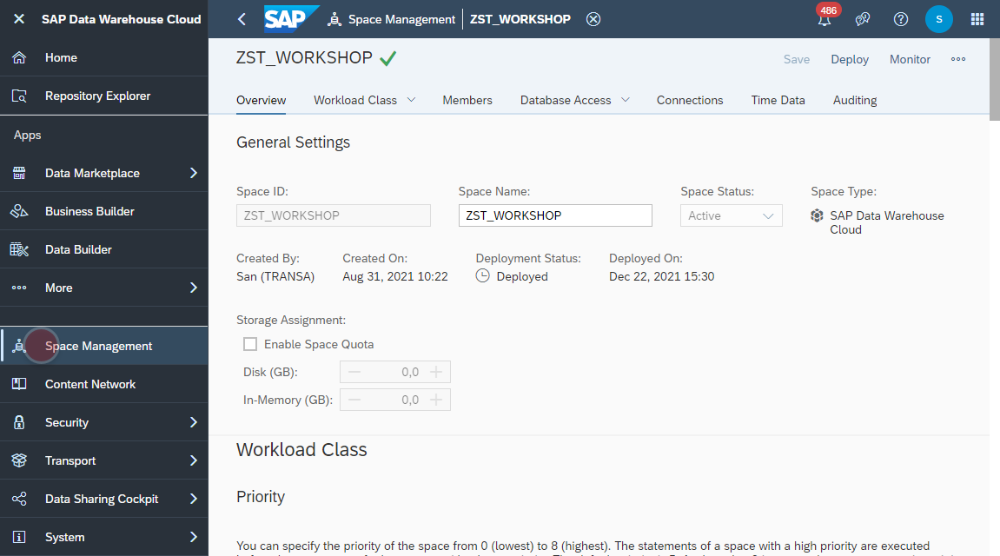

# Create _Database Access User_ 

>:mortar_board: **Database Access User**:
> SAP Data Warehouse Cloud comes by default with a preconfigured SAP HANA Database, on which the repository for all created models resides.
That repository is strictly protected and completely managed by SAP system only.   
> However, customer often still want to access the underlying SAP HANA database, in order to ingest additional data with his own preferred database client or ETL (Extract-Transform-Load) tool. For that scenario, it is possible create per space a **_Database Access User_**. That user will have access to a generated **_Open SQL Schema_, which is isolated and independent from the SAP repository**. The _Open SQL Schema_ can be used to apply database operations and SQL commands. It can either be accessed with the preinstalled _SAP HANA Database Explorer_ or any third party tool (e.g. the open source database client _DBeaver_).
> For more information plese refer to [SAP Help documentation](https://help.sap.com/viewer/9f804b8efa8043539289f42f372c4862/cloud/en-US/9ad0ddae9d8248ebb070b1dedd38eba6.html).

1. Navigate to the _Space Management_ 
    
2. Navigate to the _Database Access_ section and create a new databse user.
    
3. 
  
  
  
  
