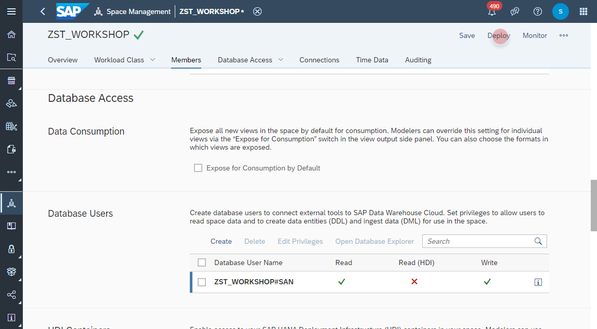

# Create _Database Access User_ 

>:mortar_board: **Push Data**:
> Another approach to ingest data is to push data into SAP Data Warehouse Cloud. 
>   
> SAP Data Warehouse Cloud comes by default with a preconfigured SAP HANA Cloud database, on which the repository for all created models resides.
However, that repository is strictly protected and completely managed by SAP system only.   
> In order to **write data** into the underlying database, we have to create a dedicated _**Database Access User**_ and a database schema (**_Open SQL Schema_**), which is fully isolated and independent from the SAP managed repository. Then, the database schema can be used to apply database operations and SQL commands. It can be accessed with the preinstalled _SAP HANA Database Explorer_ or any third party tool (e.g. the open source database client _DBeaver_).
>   
> For more information plese refer to [SAP Help documentation](https://help.sap.com/viewer/9f804b8efa8043539289f42f372c4862/cloud/en-US/9ad0ddae9d8248ebb070b1dedd38eba6.html).

1. Navigate to the _Space Management_ 
    
2. Navigate to the _Database Access_ section and create a new database user.
    
3. In the database user dialog please maintain the following fields:
  - Database User Name Suffix (in my example it's _SAN_).
  - Enable Read Access (SQL)
  - Allow user to grant read access to other users with Grant Options
  - Enable Write Access (SQL, DLL & DML)
    

4. A new database user should be generated and listed 
    

5. The database URL and user credentials can be grabbed by clicking on the _Info_ button. This information is required for database clients such as the SAP Database Explorer or any 3rd party tool. 
    
    
