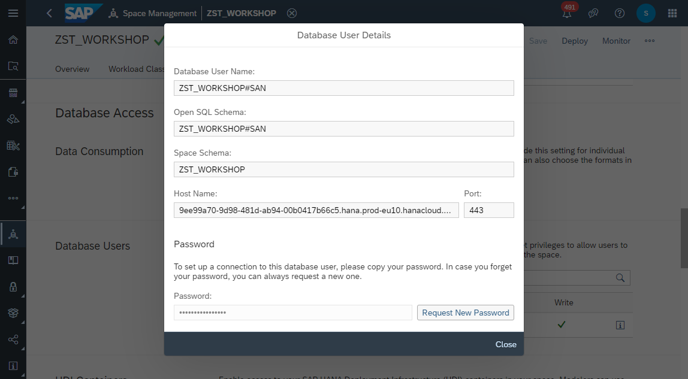

# Create _Database Access_ 
SAP Data Warehouse Cloud comes by default with a preconfigured SAP HANA Database, on which the repository for all created models resides.
That repository is strictly protected and completely managed by SAP system only. 

However, customer often still want to access the underlying SAP HANA database, in order to ingest additional data with his own preferred database client or ETL (Extract-Transform-Load) tool. For that scenario, it is possible create a _Database Access User_ with a generated _Open SQL Schema_, which is isolated and independent from the SAP repository. 
The _Open SQL Schema_ can be accessed with any tool, such as the open source _DBeaver_ and you can apply database operations and SQL commands.

https://help.sap.com/viewer/9f804b8efa8043539289f42f372c4862/cloud/en-US/9ad0ddae9d8248ebb070b1dedd38eba6.html

1. Navigate to the _Space Management_ 
    
3. 
  
  
  
  
  
