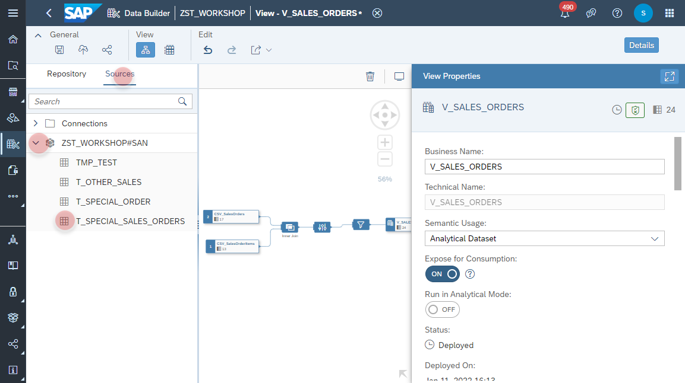

1. Navigate to the Repostiory Explorer.
2. Search and open the View **_V_SALES_ORDERS_**.
    
3. In the _Sources_ select your newly created Open SQL Schema, e.g. _ZST_WORKSHOP#SAN_ and find the tabe **_T_SPECIAL_SALES_ORDERS_**.
4. 
  
  
  
  
  
  

