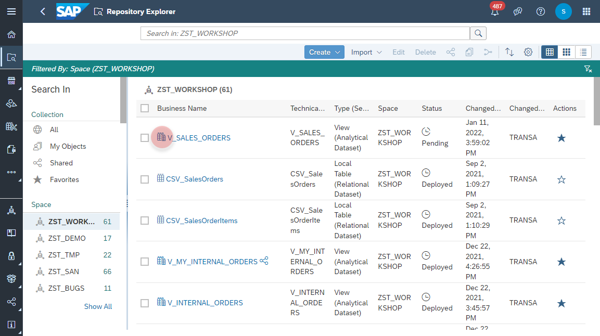
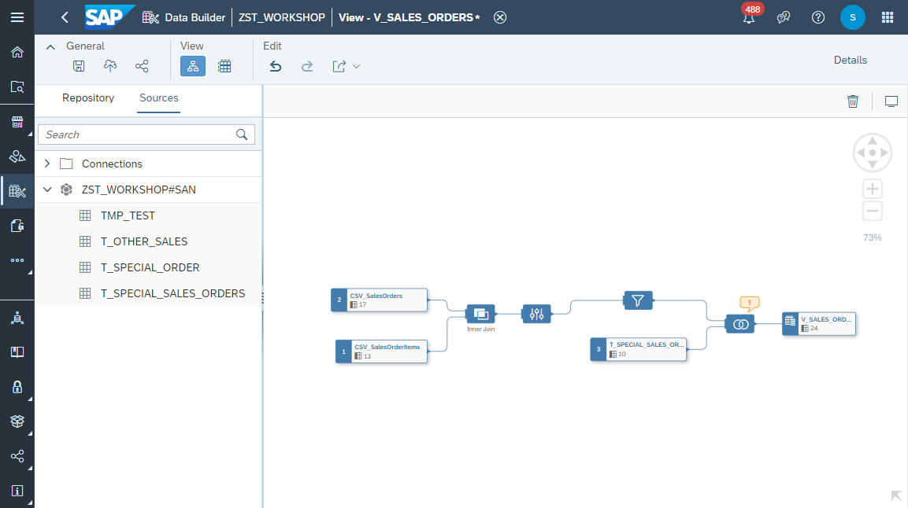
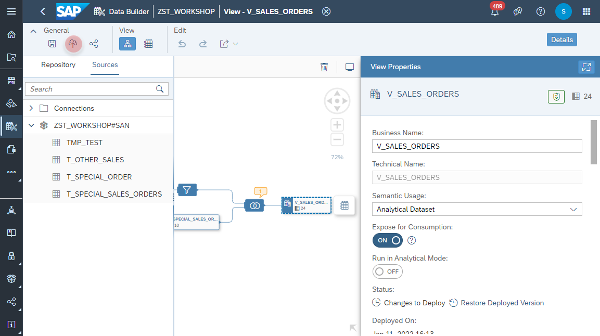

1. Navigate to the Repostiory Explorer.

2. Search and open the View **_V_SALES_ORDERS_**.
    
  
3. In the _Sources_ select your newly created Open SQL Schema, e.g. _ZST_WORKSHOP#SAN_ and find the tabe **_T_SPECIAL_SALES_ORDERS_**.
    

4. Drag and drop the table **_T_SPECIAL_SALES_ORDERS_** into the canvas on the _Filter Node_. Select the _Union_ as the operator.  
    
    
5. Select the _Union_ node and make sure that all table fields are mapped. Note: the warnings regarding mismatched data types can be ignored in this exercise. 
    

6. Click on _Deploy_ button to apply the changes.
    
  
7. Select the _Output_ node and click on _Data Preview_ from the context menu. In the results the newly created Sales Order record should be listed.
    

