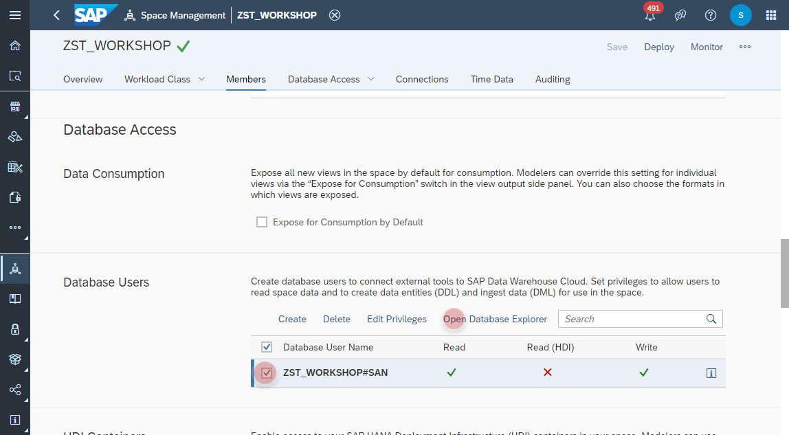
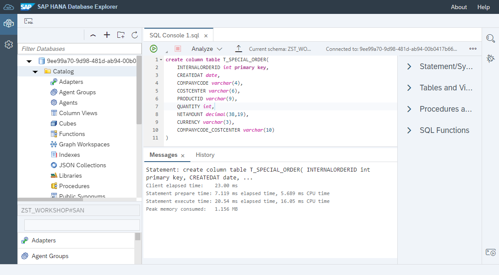
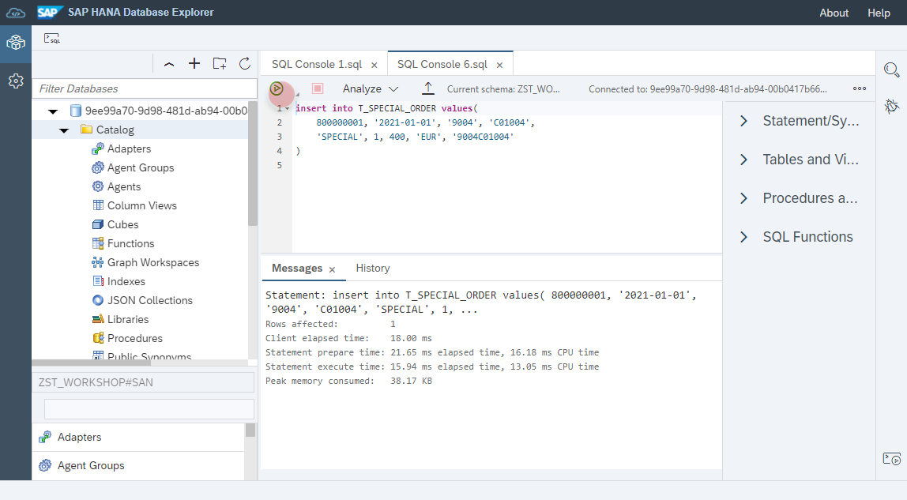

  
  
  
  
  
  
  
  

`
create column table T_SPECIAL_ORDER(
	INTERNALORDERID int primary key, 
	CREATE_DAT date, 
	COMPANYCODE varchar(4),
	COSTCENTER varchar(6),
	PRODUCTID varchar(9),
	QUANTITY int,
	NETAMOUNT decimal(38,19),
	CURRENCY varchar(3),
	COMPANYCODE_COSTCENTER varchar(10)
)
`
  
  
  
  
  
