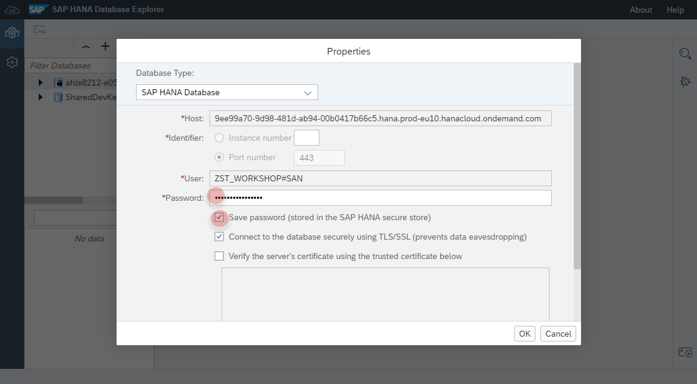
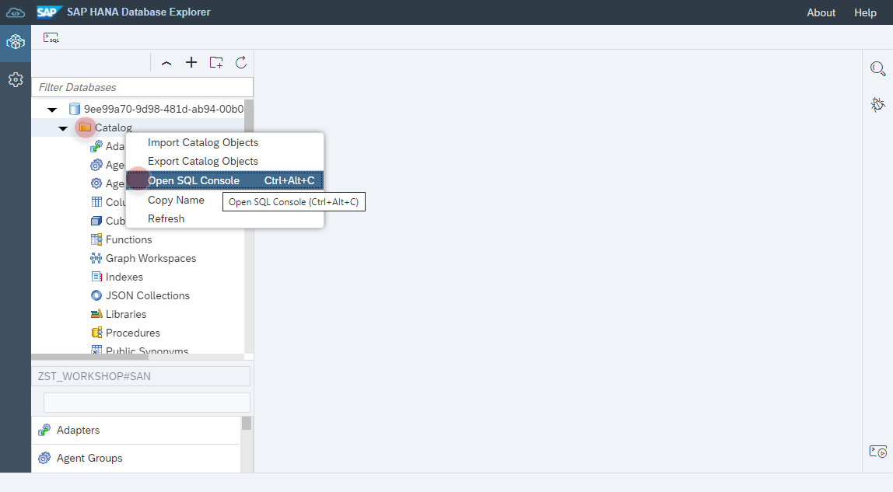
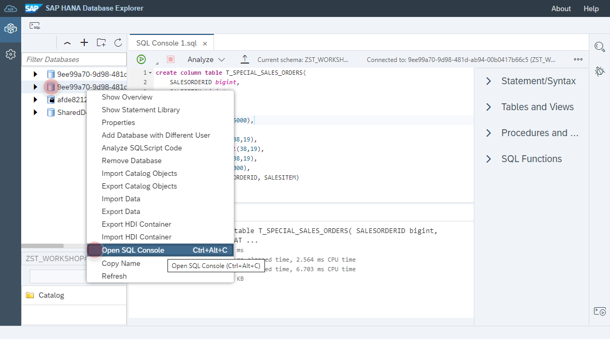
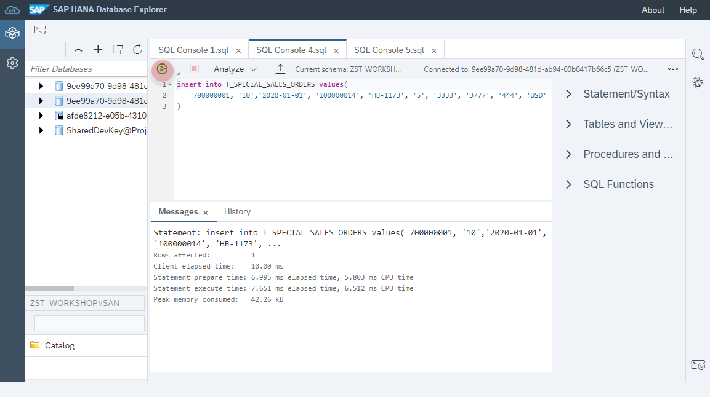
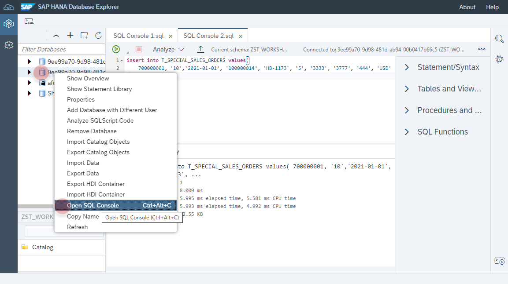
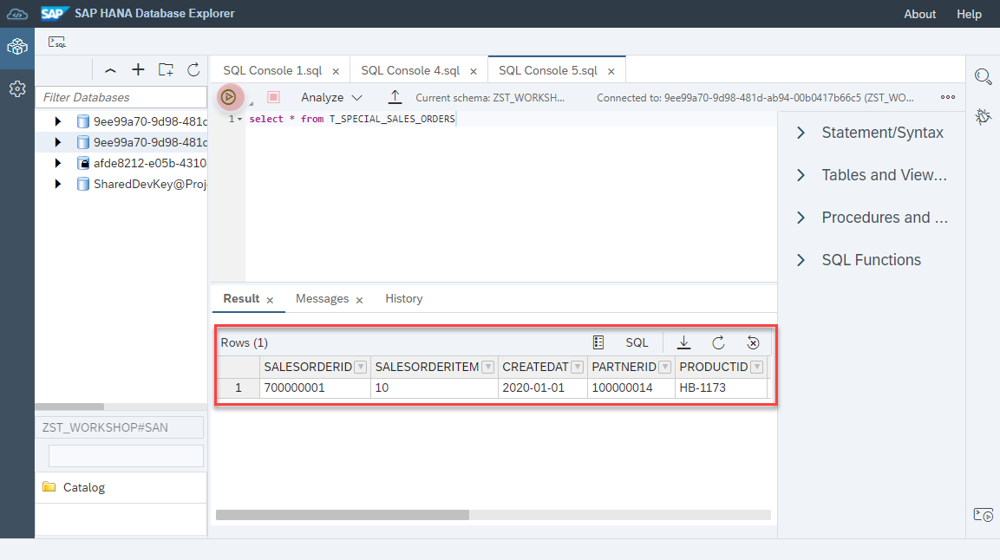

<br><br>
<br><br>
<br><br>


```
create column table T_SPECIAL_SALES_ORDERS(
	SALESORDERID bigint, 
	SALESITEM bigint,
	CREATEDAT date, 
	PARTNERID bigint,
	PRODUCTID varchar(5000),
	QUANTITY int,
	NETAMOUNT decimal(38,19),
	GROSSAMOUNT decimal(38,19),
	TAXAMOUNT decimal(38,19),
	CURRENCY varchar(5000),
	PRIMARY KEY (SALESORDERID, SALESITEM)
)
```
<br><br>
<br><br>

```
insert into T_SPECIAL_SALES_ORDERS values(	
	700000001, '10','2021-01-01', '100000014', 'HB-1173', '5', '3333', '3777', '444', 'USD'
)
```
<br><br>


<br><br>

```
select * from T_SPECIAL_SALES_ORDERS
```
<br><br>


