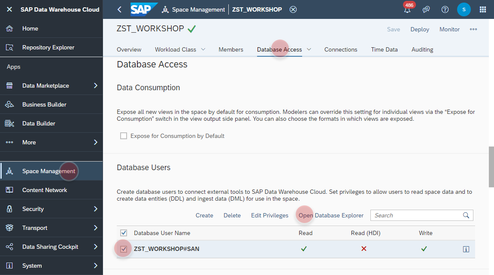
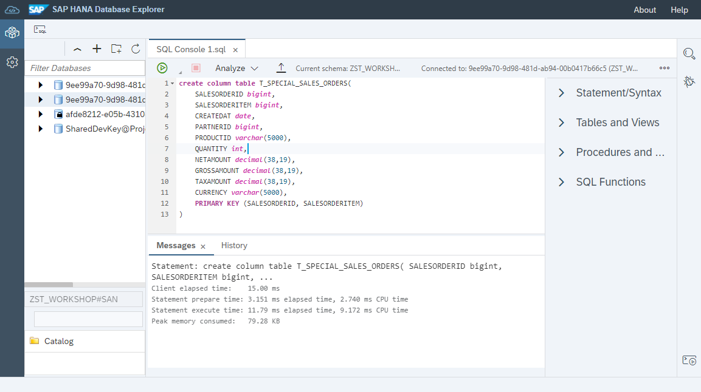
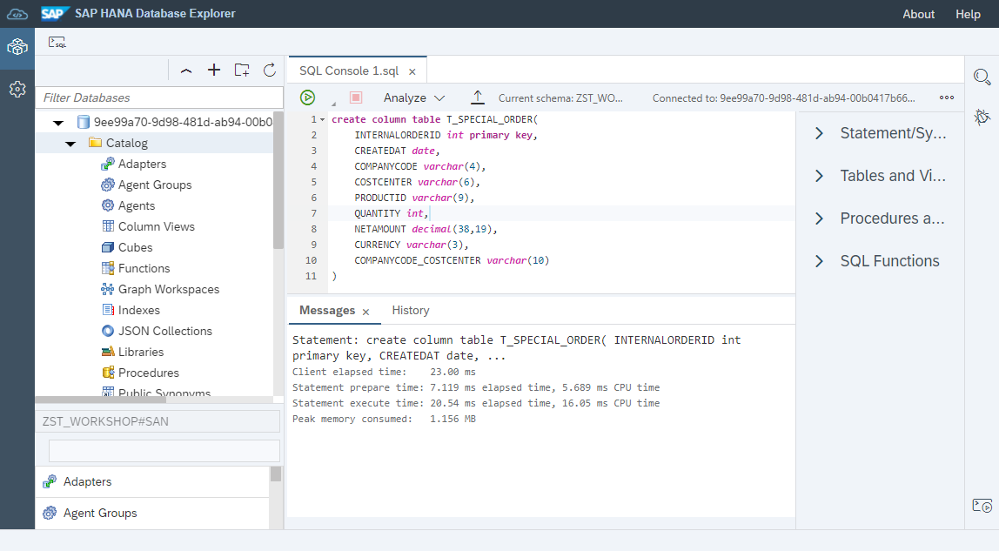
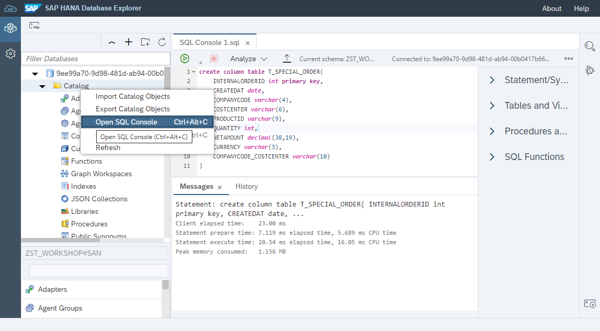
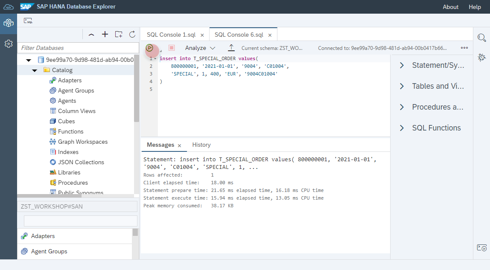
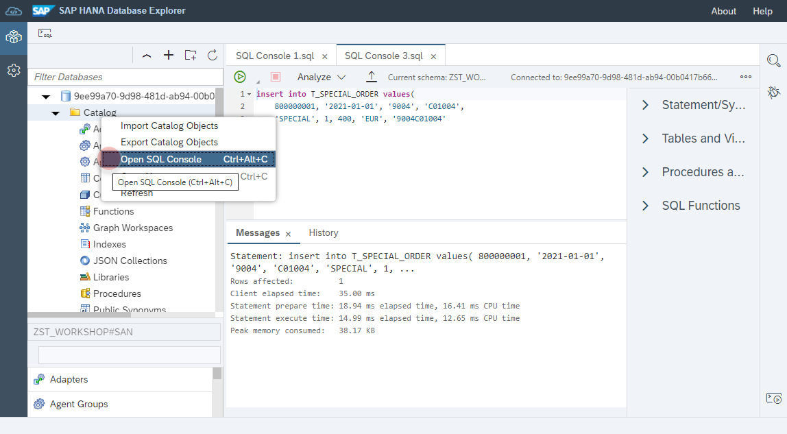
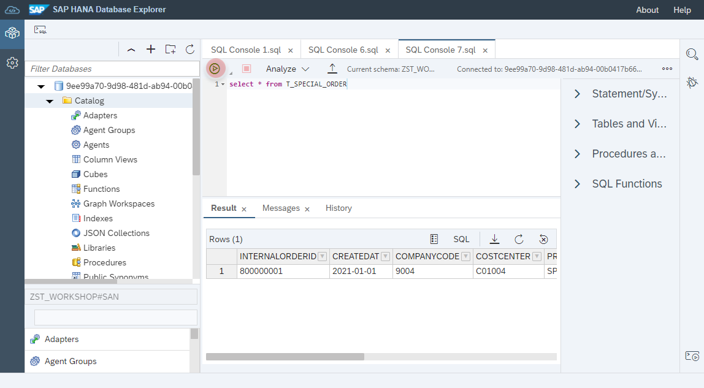

<br><br>
<br><br>


```
create column table T_SPECIAL_SALES_ORDERS(
	SALESORDERID bigint, 
	SALESITEM bigint,
	CREATEDAT date, 
	PARTNERID bigint,
	PRODUCTID varchar(5000),
	QUANTITY int,
	NETAMOUNT decimal(38,19),
	GROSSAMOUNT decimal(38,19),
	TAXAMOUNT decimal(38,19),
	CURRENCY varchar(5000),
	PRIMARY KEY (SALESORDERID, SALESITEM)
)
```

<br><br>
<br><br>

```
insert into T_SPECIAL_ORDER values(	
	800000001, '2021-01-01', '9004', 'C01004', 
	'SPECIAL', 1, 400, 'EUR', '9004C01004' 
)
```

<br><br>

```
select * from T_SPECIAL_ORDER
```
<br><br>
<br><br>
