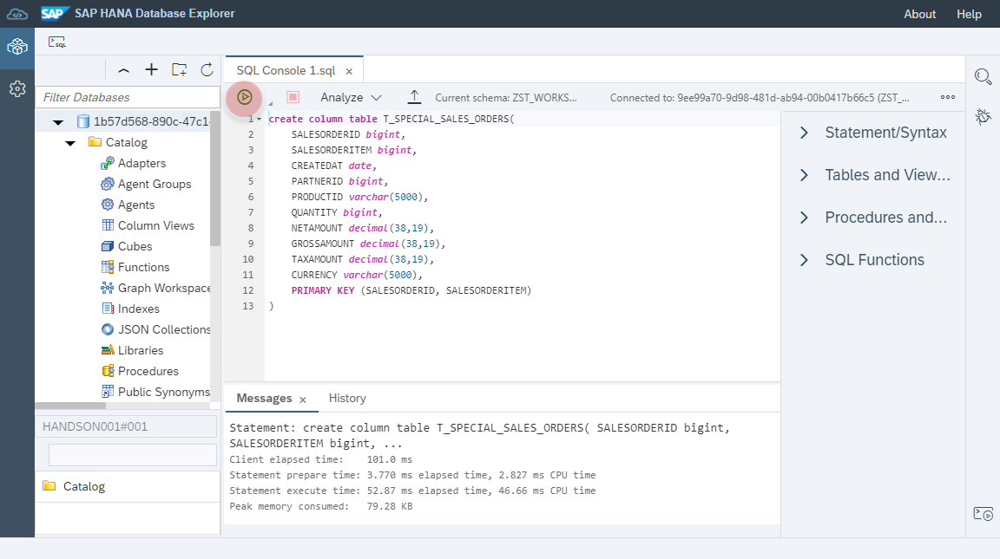
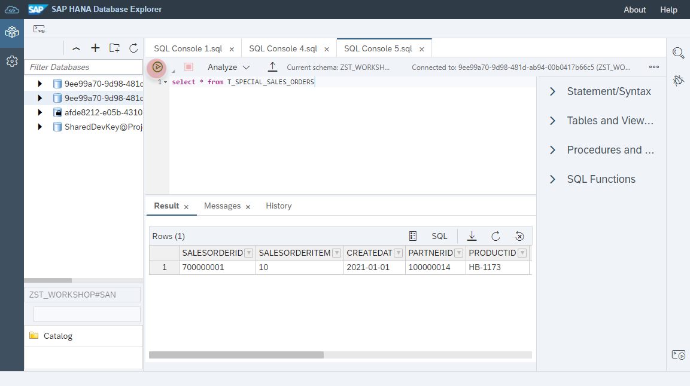

# Create a new table for _Special Sales Orders_

1. Navigate in the _Space Management_ to the _Database Access_ section.
2. Select your created database user and click on _Open Database Explorer_  
	<br>
	
3. Enter the user credentials and check the parameter _Save Password (saved in SAP HANA secure store)
	<br><br>

4. Right click on the database _catalog_ and click on _Open SQL Console_ from the context menu.
	<br><br>

5. Enter the following SQL DDL statement to create a database table for the special sales. 
	```
	create column table T_SPECIAL_SALES_ORDERS(
		SALESORDERID bigint, 
		SALESORDERITEM bigint,
		CREATEDAT date, 
		PARTNERID bigint,
		PRODUCTID varchar(5000),
		QUANTITY int,
		NETAMOUNT decimal(38,19),
		GROSSAMOUNT decimal(38,19),
		TAXAMOUNT decimal(38,19),
		CURRENCY varchar(5000),
		PRIMARY KEY (SALESORDERID, SALESORDERITEM)
	)
	```
6. Run the SQL statement. 
	<br><br>
	
7. Open a new SQL console from the context menue
	<br><br>

8. Enter the following SQL DML statement to insert data into the sales table
	```
	insert into T_SPECIAL_SALES_ORDERS values(	
		700000001, '10','2021-01-01', '100000014', 'HB-1173', '5', '3333', '3777', '444', 'USD'
	)
	```
9. Run the SQL statement
	<br><br>

10. Open a new SQL console from the context menue
	<br><br>

11. Enter the following SQL SELECT statement 
	```
	select * from T_SPECIAL_SALES_ORDERS
	```
	
12. Run the SQL statement to view the content of the table
	<br><br>


