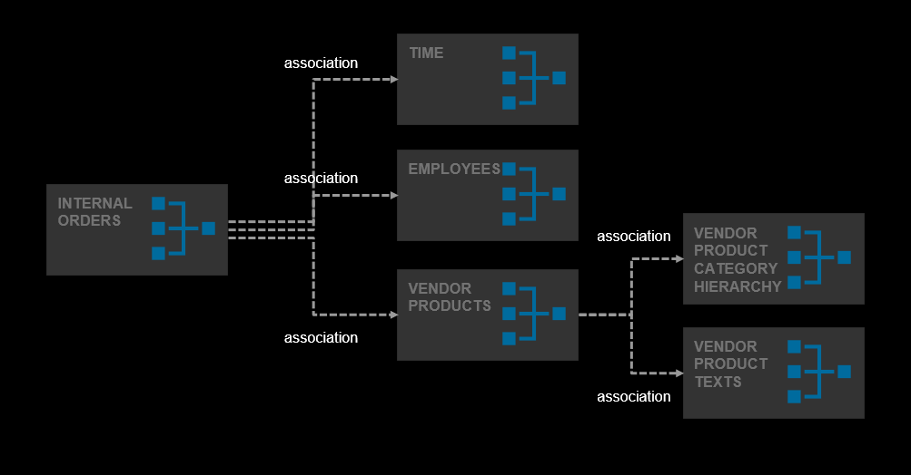

# Exercise Overview

In this exercise, you will get an overview about the models that you are going to develop in SAP Data Wareshouse Cloud.
The models will cover various modeling aspects and introduce specific features, such as Hierarchies or Input Parameters. 

## Internal Orders

After completing these steps you will have....

1.	Click here.
<br>

2.	Insert this code.
```
 DATA(lt_params) = request->get_form_fields(  ).
 READ TABLE lt_params REFERENCE INTO DATA(lr_params) WITH KEY name = 'cmd'.
  IF sy-subrc <> 0.
    response->set_status( i_code = 400
                     i_reason = 'Bad request').
    RETURN.
  ENDIF.
```
## Sales Orders

## Summary

Now that you have ... 
Continue to - [Exercise 1 - Exercise 1 Description](../ex1/README.md)
